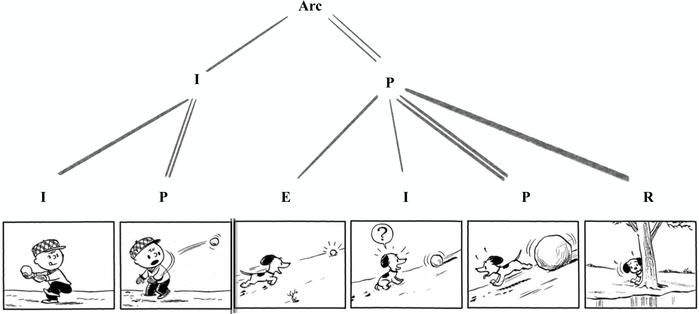
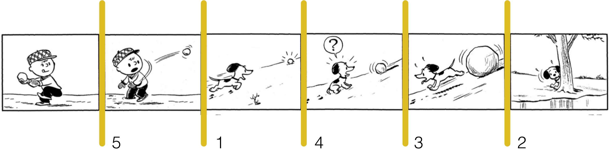
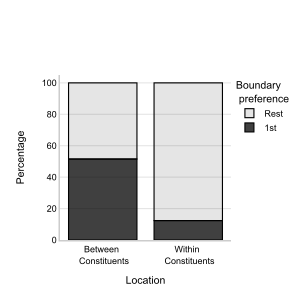
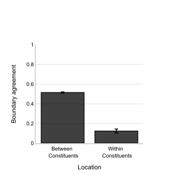
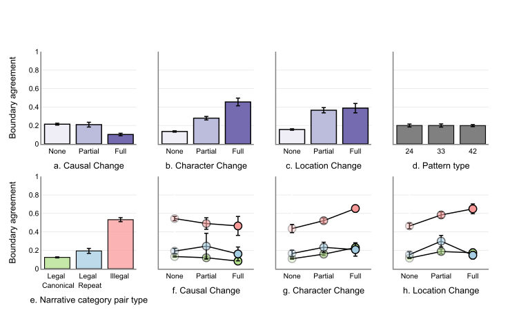
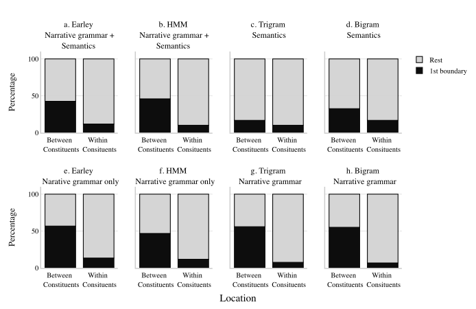

# Is grammar a property of language, or of thought?

Language is not the only way to carry a complex thought. A handful of pictures can do it too, and readers agree on how those pictures group into a story. When a parser built for sentences is handed a grammar for pictures, it groups them the same way. Grammar may be a property of how we think, not just of what we say.

<video class="post-hero" autoplay muted playsinline preload="auto"
       poster="/assets/images/fig-narrative-grammar-poster.jpg"
       width="1080" height="608"
       aria-label="An Earley parser building a hierarchical structure over a wordless comic strip, panel by panel">
  <source src="/assets/images/fig-narrative-grammar.webm" type="video/webm">
  <source src="/assets/images/fig-narrative-grammar.mp4" type="video/mp4">
</video>

<!-- more -->

A visual narrative is a story told in pictures. A few panels, no words, and you follow a
complex thought from beginning to end: who wanted what, what went wrong, how it ended.
We have been doing this for a very long time. The animals on the cave walls at Lascaux
and Chauvet are not a catalogue. They are arranged, and some of them seem to be telling
a story, tens of thousands of years before anyone wrote anything down. At the other end
of the scale sits language, the most sophisticated medium we have for conveying thought,
and its defining feature is that it is richly organized. Words do not pile up. They nest
into phrases and clauses according to grammatical rules, and that structure is what makes
"the dog the cat chased ran" a sentence and "chased ran dog the cat the" a jumble of the
same words. Here is the question that interests me. Is grammar a by-product of the
languages we happen to speak? Or does it reflect the organizational structure of the
thoughts themselves, so that any medium that carries a complex thought will show the
same shape? Knowing which would be a crucial step toward understanding how we think.

Visual narratives are a good place to look, because they carry complex thoughts with no
words at all. In this study, with Neil Cohn, we asked whether a wordless sequence of
pictures has organizational principles of its own, similar to the grammar of a
language.[^vng] Neil has spent a career arguing that it does. In his theory of **visual
narrative grammar**, a sequence of pictures has a structure separate from what the
pictures mean, and that structure has the same nested, tree-like shape as a sentence. We
set out to test that with readers, and then with a computer program built to read
sentences.

[^vng]:
    Cohn (2013), Visual narrative structure, *Cognitive Science*,
    [doi:10.1111/cogs.12016](https://doi.org/10.1111/cogs.12016). For the deeper
    background on stories having a structure, see Mandler & Johnson (1977), Remembrance of
    things parsed: Story structure and recall, *Cognitive Psychology*,
    [doi:10.1016/0010-0285(77)90006-8](https://doi.org/10.1016/0010-0285(77)90006-8).

<figure markdown="span">
  { .headshot }
  <figcaption><a href="https://www.visuallanguagelab.com/">Neil Cohn</a> <small>Communication and Cognition, Tilburg University</small></figcaption>
</figure>

## A grammar made of pictures

The idea works like this. Each panel in a strip plays a role in a little arc. An
**Establisher** sets up the situation. An **Initial** starts an action. A **Peak** is the
climax, the panel with the most going on. A **Release** shows the aftermath. A typical arc
runs in that order: E, I, P, R. Not every strip has all four, and the interesting part is
that the roles can nest. A group of panels can together act as one big Initial for a larger
arc, and inside that group each panel has its own small role.

<figure markdown="span">
  
  <figcaption>The snowball strip as a tree. The first two panels form an Initial for the whole arc, since without the throw nothing else happens. The last four form the arc's Peak. Inside each group the panels have their own roles. Figure 1 from Upadhyayula & Cohn (2025), <em>Cognitive Science</em>. Panels from <em>Peanuts</em> by Charles Schulz.</figcaption>
</figure>

Look at the snowball strip through this lens. Charlie Brown winding up is an Initial, and
the throw is a Peak. Together those two panels are the set-up for everything that
follows, so as a pair they act as one Initial for the whole strip. Then Snoopy meets the
snowball, an Establisher, realizes it is growing, an Initial, runs, a Peak, and hides, a
Release. That group of four is the strip's main event, its Peak.

Read left to right, the panel roles run I, P, E, I, P, R. A Peak followed by an
Establisher is a strange pairing. Nothing in a simple arc puts a climax right before a
set-up. The tree explains why the strip still reads smoothly: the P and the E belong to
different branches. The pairing looks illegal only if you ignore the hierarchy. That is
the claim we set out to test. Do readers treat a strip as a flat chain of panels, or as a
tree?

## Where does a strip break?

The first experiment reused a simple task from an earlier study by Neil and Ryan
Bender.[^bender] Fifty-four comic readers at Tufts University were handed 120 wordless
Peanuts strips, six panels each, and a pencil. For every strip they drew a line at the
gap where the strip most naturally split in two and labeled it 1. Then they kept
splitting until every gap between panels had a number from 1 to 5.

[^bender]:
    Cohn & Bender (2017), Drawing the line between constituent structure and coherence
    relations in visual narratives, *Journal of Experimental Psychology: Learning, Memory,
    and Cognition*, [doi:10.1037/xlm0000290](https://doi.org/10.1037/xlm0000290).

<figure markdown="span">
  
  <figcaption>The segmentation task. Readers ranked all five gaps, with 1 marking the most natural place to split the strip. Figure 2 from Upadhyayula & Cohn (2025), <em>Cognitive Science</em>. Panels from <em>Peanuts</em> by Charles Schulz.</figcaption>
</figure>

Every strip had been coded beforehand, using the grammar, as two groups of panels, so
there was one theoretical boundary per strip. If readers were choosing at random among the
five gaps, they would land on it one time in five. They chose it first about half the
time, and any given gap elsewhere in the strip only about one time in eight, which
suggests that some organizational structure is present when reading these wordless
stories.

<figure markdown="span">
  { width="100%" }
  <figcaption>How often each kind of gap was ranked first. Chance is one in five. Figure 4a from Upadhyayula & Cohn (2025), <em>Cognitive Science</em>.</figcaption>
</figure>

<figure markdown="span">
  { width="100%" }
  <figcaption>Agreement across readers, the share who put their first line at a given gap. Figure 4b from Upadhyayula & Cohn (2025), <em>Cognitive Science</em>.</figcaption>
</figure>

We then asked what was driving the agreement. Two kinds of things could. One is
meaning: a new character walks in, the scene moves somewhere else, one thing causes
another. Discourse theories of stories have long held that changes like these are what
make a boundary.[^situation] The other is the grammar: some role pairings, like a Peak
followed by an Establisher, cannot sit inside the same group, so they should force a
break. We coded every gap for both and asked which predicted where readers drew their
first line.

[^situation]:
    Zwaan & Radvansky (1998), Situation models in language comprehension and memory,
    *Psychological Bulletin*,
    [doi:10.1037/0033-2909.123.2.162](https://doi.org/10.1037/0033-2909.123.2.162).

<figure markdown="span">
  { width="100%" }
  <figcaption>What predicts a boundary. Each panel plots boundary agreement, the share of readers who put their first line at a gap. <strong>Top row:</strong> agreement by how much the meaning changes across the gap. It barely moves with causal change (a), rises with a change of characters (b) and of location (c), and does not depend on where in the strip the theoretical boundary falls, whether after the second, third, or fourth panel (d). <strong>Bottom row:</strong> the grammar. Gaps at role pairings the grammar forbids inside a group (e, "Illegal") draw far more first lines than legal pairings. Panels f, g, and h replot the meaning changes with the gaps colored by pairing type, and the illegal pairings sit above the others at every level of change. In other words, changes in who and where matter, whether one panel caused the next does not, and the grammar adds something that meaning alone cannot explain. Error bars and shading show standard error. Figure 5 from Upadhyayula & Cohn (2025), <em>Cognitive Science</em>.</figcaption>
</figure>

Meaning mattered. A change of characters or of location between two panels made readers
more likely to split there. But the strongest single predictor was the grammar. Gaps
with a forbidden pairing on either side drew far more first lines than any other kind,
even after accounting for the changes in meaning. And one kind of meaning change did
nothing at all. Whether one panel caused the next had no effect on where people split the
strip, which was a surprise, since causation is usually treated as a backbone of stories.
Readers were not aware of the grammar. They had never heard of Establishers and Peaks.
Yet the categories predicted their choices.

??? note "More details about the segmentation experiment"

    The 120 strips were built from panels in *The Complete Peanuts*, volumes 1 to 9, with
    all text removed, and had been used in earlier studies. Each strip was coded by both
    authors following the diagnostic tests of visual narrative grammar into two groups of
    panels, with the split falling after the second, third, or fourth panel, 40 strips of
    each kind. Changes in characters, location,
    and causation between consecutive panels were coded as 0, 0.5, or 1. Boundary agreement
    for a gap is the fraction of the 54 readers who put their first line there. The
    theoretical boundary was ranked first 51.5% of the time versus 12.4% for other gaps,
    with agreement of 0.26 versus 0.18, t(598) = 18.1. A mixed model with gap position as
    a random effect explained 63% of the variance. Forbidden pairings added 0.29 to
    agreement, full character change 0.12, full location change 0.08. Causal change and
    the position of the split had no reliable effect.

## Teaching a computer to read comics

Readers agree with the grammar. But that first experiment cannot tell a tree from a chain.
"A Peak followed by an Establisher forces a break" is a rule about neighbors, and a flat
list of allowed neighbors might do the job just as well as a nested structure. To ask
about hierarchy, we needed something that could actually hold a hierarchy in its head.
So we borrowed from computational linguistics.

The central idea there is **surprisal**. As you read a sentence word by word, a model
keeps guessing what comes next. When the next word is one it expected, surprisal is low.
When the word is unexpected, surprisal is high. Surprisal tracks reading times
remarkably well, and it spikes at the start of a new phrase, exactly where structure
changes.[^surprisal] If readers of comics are doing something similar, a model that
guesses the next panel should be most surprised right after a boundary. And we could
score its guesses against where readers drew their lines.

[^surprisal]:
    Hale (2001), A probabilistic Earley parser as a psycholinguistic model, *Proceedings
    of NAACL*, [doi:10.3115/1073336.1073357](https://doi.org/10.3115/1073336.1073357);
    Levy (2008), Expectation-based syntactic comprehension, *Cognition*,
    [doi:10.1016/j.cognition.2007.05.006](https://doi.org/10.1016/j.cognition.2007.05.006).

We built three kinds of model, each given the same 120 strips, and they differed in what
they could represent.

- **An Earley parser** is the kind of program that linguists use to parse sentences with
  a tree-shaped grammar. We handed it the visual narrative grammar as a set of tree rules,
  plus the meaning changes in each panel, and let it predict each panel from the ones
  before. It is the only model of the three that can represent nesting.
- **A hidden Markov model** knows the narrative roles too, but only as a chain. It learns
  how often an Initial is followed by a Peak, a Peak by a Release, and so on, and it
  pairs each role with the meaning changes that tend to come with it. No trees.
- **N-gram models** are the simplest possible baseline. They count how often one thing
  follows another, either the roles or the meaning changes but never both.

Each model was trained on nine tenths of the strips and tested on the rest, a hundred
times over, and its surprisal for every panel was averaged. The panel with the highest
surprisal was the model's first choice of where to split the strip.

The animation at the top of this post shows the Earley parser at work on one of the
strips, building its tree one panel at a time.

<figure markdown="span">
  
  <figcaption>How the models did. Top: surprisal by panel position, with the boundary between positions −1 and +1. Bottom: the more surprised a model was at a gap, the more readers had split there. Figure 8 from Upadhyayula & Cohn (2025), <em>Cognitive Science</em>.</figcaption>
</figure>

Every model's surprisal predicted where readers drew their first line, and every model
was more surprised by the first panel after the boundary than by the one before it. When
we ranked each model's surprisals and asked where it would split the strip, the models
with the grammar behaved like people. The Earley parser picked the theoretical boundary
first on 43% of strips, and 57% when it had the grammar alone, against a chance level of
20%. The model that knew only meaning, and nothing about roles, was the one that failed.

<figure markdown="span">
  { width="100%" }
  <figcaption>Where each model would split the strip. The dark bars are first choices. Only the meaning-only trigram model fails to prefer the real boundary. Figure 10 from Upadhyayula & Cohn (2025), <em>Cognitive Science</em>.</figcaption>
</figure>

??? note "More details about the models"

    Surprisal for a panel is the negative log probability of that panel given the
    preceding panels and the model's context. The Earley parser used a probabilistic
    context-free grammar built from the 120 hand-coded trees, with meaning changes at the
    leaves, implemented in Python with NLTK. The hidden Markov model treated the narrative
    roles as hidden states and the meaning changes as emissions, using hmmlearn. Bigram and
    trigram models were fit separately to roles and to meaning changes. Each strip was
    held out while the models trained on a random 90% of the others, repeated 100 times.
    Mean surprisals: Earley with grammar and meaning 3.40 bits, HMM 3.05 bits. In mixed
    models predicting boundary agreement, all surprisal measures were significant; the
    grammar-only n-grams had the lowest AIC. Surprisal was higher after than before the
    boundary for every model, t(119) between 6.0 and 14.7. First-choice rates for the true
    boundary: Earley 42.5%, HMM 45.8%, Earley grammar-only 56.6%, HMM grammar-only 43.3%,
    role bigram 55%, role trigram 55.8%, meaning bigram 33.3%, meaning trigram 16.7%.

## What we learned, and what we did not

The clearest result is that a grammar for pictures is real in readers' behavior. People
who have never heard of narrative roles split strips where the roles say they should, and
a parser that knows only those roles splits them in the same places. Meaning helps, but
meaning alone is not enough, and one kind of meaning, causation, does not enter into it at
all. That fits a picture in which the structure of a story and the content of a story are
handled by separate systems working side by side, a claim Neil's earlier brain-recording
work had pointed toward.[^erp]

[^erp]:
    Cohn, Jackendoff, Holcomb & Kuperberg (2014), The grammar of visual narrative: Neural
    evidence for constituent structure in sequential image comprehension,
    *Neuropsychologia*,
    [doi:10.1016/j.neuropsychologia.2014.09.018](https://doi.org/10.1016/j.neuropsychologia.2014.09.018).

All three kinds of model fit the task. On six-panel strips, a parser with a tree, a
Markov model with a chain, and even a plain count of which role follows which all
predicted where readers split the strip. But fitting this task is not the same as being
a theory of how people read, and each model has shortcomings that the task was too small
to expose. An n-gram model only ever looks back one or two panels. It has no way to
represent a connection between the first panel of a strip and the fifth, so in a longer
narrative, where the payoff of a set-up may arrive many panels later, it has nothing to
say. It has a deeper problem too. Theories of visual narrative comprehension hold that
the grammar and the meaning are processed side by side, as two parallel streams, and
there is brain-recording evidence for that separation.[^parallel] Modeling the two in parallel means
tracking how one role leads to the next and, at the same time, how each role tends to go
with particular changes in meaning. An n-gram can count one of those or the other, never
both at once. That is why we treated the n-grams as a baseline rather than a candidate
theory, and why the discussion in the paper rests on the parser and the Markov model,
which can hold both streams.

[^parallel]:
    For the theories, see Cohn (2020), Your brain on comics: A cognitive model of visual
    narrative comprehension, *Topics in Cognitive Science*,
    [doi:10.1111/tops.12421](https://doi.org/10.1111/tops.12421), and Loschky, Larson,
    Smith & Magliano (2020), The Scene Perception & Event Comprehension Theory (SPECT)
    applied to visual narratives, *Topics in Cognitive Science*,
    [doi:10.1111/tops.12455](https://doi.org/10.1111/tops.12455). For the brain evidence,
    see Cohn, Paczynski, Jackendoff, Holcomb & Kuperberg (2012), (Pea)nuts and bolts of
    visual narrative: Structure and meaning in sequential image comprehension, *Cognitive
    Psychology*,
    [doi:10.1016/j.cogpsych.2012.01.003](https://doi.org/10.1016/j.cogpsych.2012.01.003),
    which found that the brain's response to meaning was blind to the presence of
    narrative structure, and the earlier footnote on Cohn and colleagues (2014).

The Markov model can carry more, but it is still a chain: each panel is predicted
from the previous state alone, and a relationship that skips over intervening panels has
to be smuggled in through the states. Intuitively, the tree looks like the
structure built for the job. It represents a long-distance dependency directly, as one
branch spanning a whole group of panels, and it should pull ahead as dependencies get
longer. But intuition is not evidence. Given enough data, a Markov model can pick up
surprisingly rich statistical regularities, and it is entirely possible that a chain
armed with those regularities would do the trick just as well. Who knows. That is why
the question needs longer strips and richer datasets rather than an argument.

It is also not a new question. The same argument has run through linguistics for
years. One camp holds
that sentence comprehension is fundamentally hierarchical, that structures, not strings,
are what the mind builds.[^strings] Another argues that much of everyday language use can
be explained by sequential, chain-like statistics, with hierarchy invoked only when it
is needed.[^hierarchical] The models in this study are the visual-narrative versions of
those two positions, and the tools for telling them apart are the same tools.

[^strings]:
    Everaert, Huybregts, Chomsky, Berwick & Bolhuis (2015), Structures, not strings:
    Linguistics as part of the cognitive sciences, *Trends in Cognitive Sciences*,
    [doi:10.1016/j.tics.2015.09.008](https://doi.org/10.1016/j.tics.2015.09.008).

[^hierarchical]:
    Frank, Bod & Christiansen (2012), How hierarchical is language use?, *Proceedings of
    the Royal Society B*,
    [doi:10.1098/rspb.2012.1741](https://doi.org/10.1098/rspb.2012.1741).

To my knowledge this is the first study to draw that distinction for visual narratives
and to build the framework in which it can be tested. What it establishes is that the
question is now answerable. Readers behave as if there is a grammar, computational models
carrying that grammar behave like readers, and the models disagree with one another in
principled ways that longer sequences and richer datasets will expose. That is what I
hope to do next: take the same framework to strips with many more panels, with stories
nested inside stories, and see whether the tree earns its keep.

There is a thread here that runs through the other posts on this blog. In the
[film post](why-you-miss-it-when-a-movie-skips.md), the brain bridged gaps by predicting
what should come next. Surprisal is that same idea made precise: a number for how badly
the prediction failed. In comics, the predictions come from a grammar. When a panel
arrives that the grammar did not expect, the story breaks there, for a parser and for a
person alike.

*Upadhyayula & Cohn (2025). A computational framework to study hierarchical processing
in visual narratives. Cognitive Science, 49(5), e70050.*
[:material-file-document: Paper](https://doi.org/10.1111/cogs.70050) ·
[:material-database: Data & code](https://osf.io/s2h5x/) ·
[:material-youtube: Talk](https://www.youtube.com/watch?v=eEBSmQwxVmk)

[:material-flask-outline: This work in the research section: Does visual narrative comprehension involve a grammar?](../../research/organized/visual-narrative-grammar.md)

---

<small>
**Figure credits.** The opening animation is by the author. Figures 1, 2, 4, 5, 8, and 10
are reproduced from Upadhyayula & Cohn (2025), *Cognitive Science*,
[doi:10.1111/cogs.70050](https://doi.org/10.1111/cogs.70050), published under a
CC BY-NC-ND 4.0 license. The *Peanuts* panels in Figures 1 and 2 are © Peanuts Worldwide
LLC and appear as they do in the article. The headshot is the staff portrait from
[Tilburg University](https://www.tilburguniversity.edu/staff/n-cohn).
</small>
