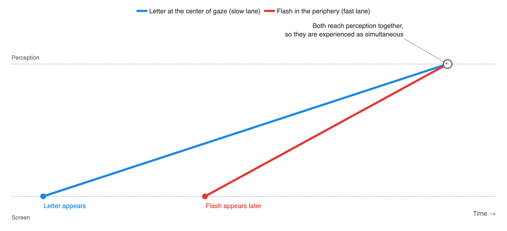
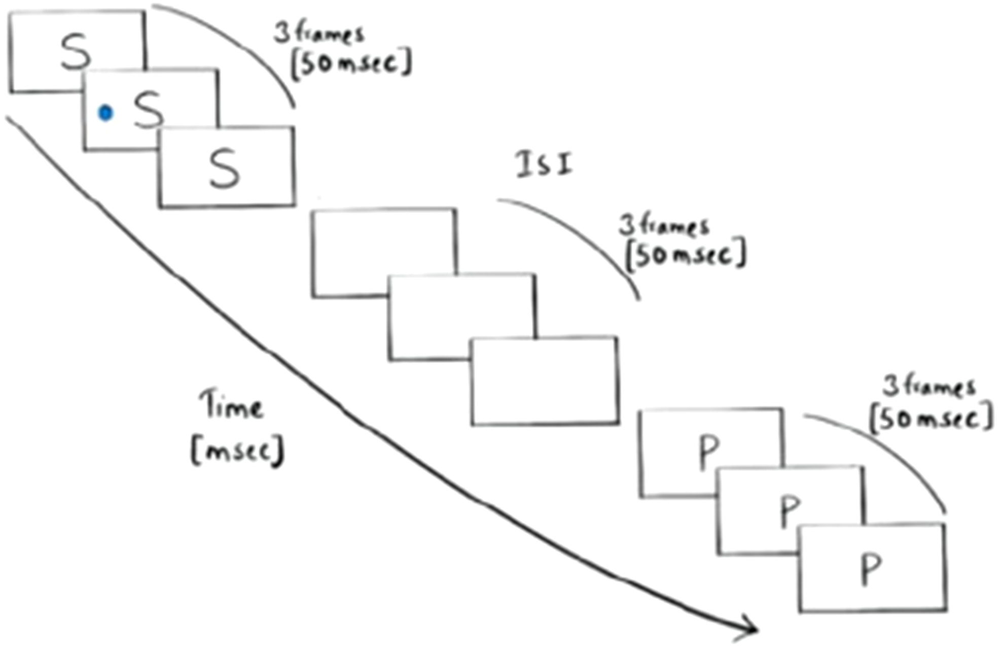
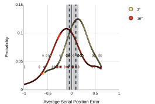
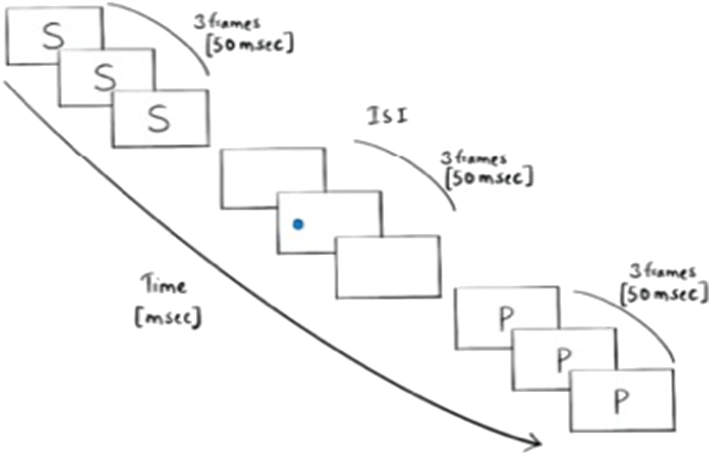
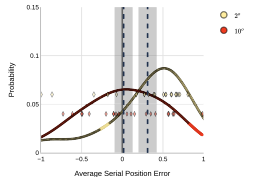
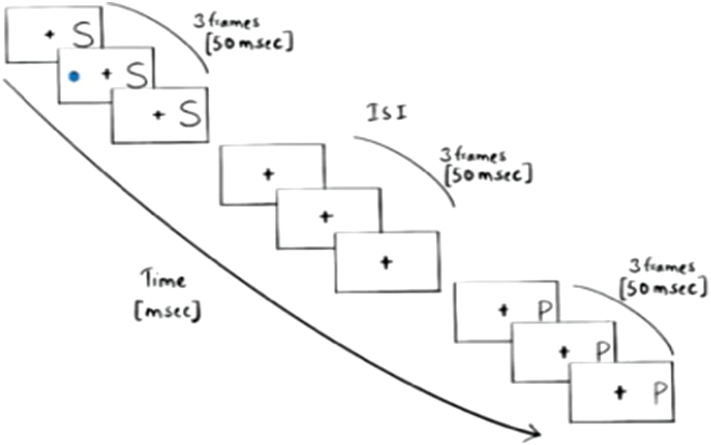
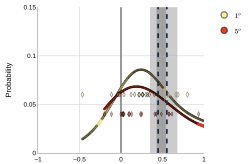
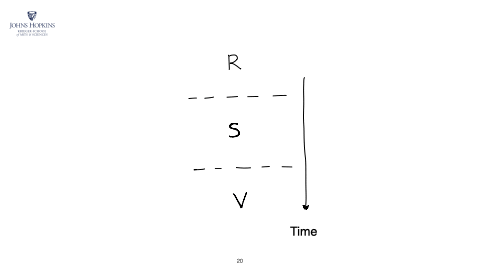
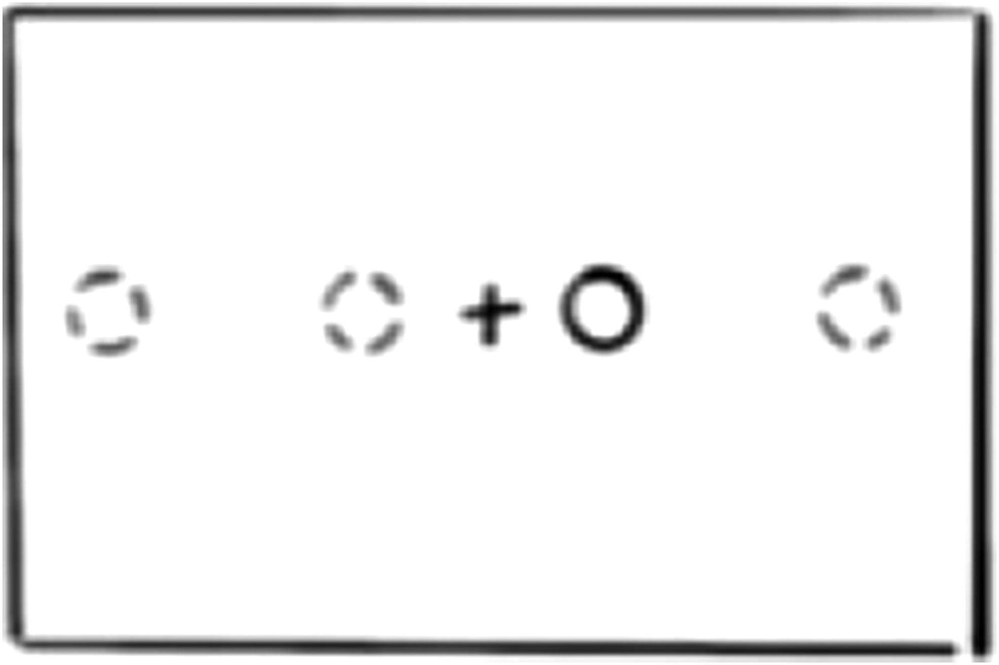
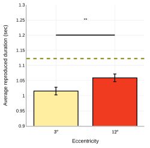

# What you see as "now" is not one moment

Two things that never appeared together on a screen can be seen as happening at once. Four experiments show why: the edge of your vision reaches perception faster than the center.

<video class="post-hero" autoplay muted playsinline preload="auto"
       poster="/assets/images/fig-visual-now-poster.jpg"
       width="960" height="540"
       aria-label="Animation over a racing game screenshot: the center of gaze is labelled current information and the surrounding periphery is labelled past information">
  <source src="/assets/images/fig-visual-now.webm" type="video/webm">
  <source src="/assets/images/fig-visual-now.mp4" type="video/mp4">
</video>

<!-- more -->

Time is the one thing everybody is short of. It is precious the way money is precious,
except that nobody can lend you an hour, and you cannot put one aside for later. The clock
is always ticking. We build our lives around it: deadlines, alarms, appointments, the last
train home. Whole industries exist
to help us save it, and we still lose it. It is strange, then, that we do not have a
dedicated system in the brain to process it.

Think about what that means. Light lands on the retina and is handled by visual cortex.
Pressure on the skin goes to somatosensory cortex. Sound is decoded in auditory cortex.
Every other thing we sense has a dedicated instrument and a patch of brain that reads it.
Time has neither. Nobody has found a region that works like a clock, counting off moments
the way the eye registers brightness or the ear registers pitch.[^1] We spend our lives
running after a quantity we may have no machinery to measure. And yet we have an
unmistakable sense of it. We know when two things happened together, which came first,
and roughly how long each one lasted. Where does that sense come from, if not from a
clock?

[^1]:
    One common proposal is a neural accumulator that counts pulses of processing, but
    no such mechanism has been identified. For the possibilities, see Mauk & Buonomano
    (2004), The neural basis of temporal processing, *Annual Review of Neuroscience*,
    [doi:10.1146/annurev.neuro.27.070203.144247](https://doi.org/10.1146/annurev.neuro.27.070203.144247),
    and Wearden (2016), *The Psychology of Time Perception*, Springer. I discuss three
    ways the mind could represent time without a clock in Chapter 2 of my dissertation
    (Upadhyayula, 2021, Johns Hopkins University).

One possibility is that the mind reads time off other things. If you know a walk takes
twenty minutes, distance tells you duration. If one flash appears to move toward another,
motion tells you which came first. Judgments like these can be right most of the time and
still go wrong in systematic ways, and the ways they go wrong are the illusions of time.
Pay attention to one of two identical flashes and it seems to appear first, an effect
known since the nineteenth century as prior entry.[^2] A beep and a flash that start
together do not feel simultaneous; the flash has to lead slightly for that.[^3] In each
case the visual system has to decide what happened when, and it decides with whatever
signals it has.

[^2]:
    Titchener (1908), *Lectures on the Elementary Psychology of Feeling and Attention*,
    Macmillan. For a modern review, see Spence & Parise (2010), Prior-entry: A review,
    *Consciousness and Cognition*,
    [doi:10.1016/j.concog.2009.12.001](https://doi.org/10.1016/j.concog.2009.12.001).

[^3]:
    Stone et al. (2001), When is now? Perception of simultaneity, *Proceedings of the
    Royal Society B*, [doi:10.1098/rspb.2000.1326](https://doi.org/10.1098/rspb.2000.1326).
    For a review of how the senses are kept in step, see Vroomen & Keetels (2010),
    Perception of intersensory synchrony: A tutorial review, *Attention, Perception &
    Psychophysics*, [doi:10.3758/APP.72.4.871](https://doi.org/10.3758/APP.72.4.871).

That raises a harder question. Is the present moment itself an illusion? William James
did not think the present was an instant at all. In *The Principles of Psychology* he
wrote:

> The practically cognized present is no knife-edge, but a saddle-back, with a certain
> breadth of its own on which we sit perched, and from which we look in two directions
> into time. The unit of composition of our perception of time is a duration, with a bow
> and a stern, as it were, a rearward and a forward-looking end.

A saddle rather than a knife-edge. Modern estimates put that saddle at around a tenth of
a second.[^4] Whatever falls inside it is experienced as *now*, and so the question is
what falls inside it. If the present has breadth, could it hold two events that never
happened together?

[^4]:
    White (2020), The perceived present: What is it, and what is it there for?,
    *Psychonomic Bulletin & Review*,
    [doi:10.3758/s13423-020-01726-7](https://doi.org/10.3758/s13423-020-01726-7).

This paper, written with Ian Phillips and Jonathan Flombaum, sets out to find how a moment
in time is perceived, using the one part of the visual system where we already know
processing runs at different speeds: the difference between the center of your gaze and
its edges.

<figure markdown="span">
  { .headshot }
  <figcaption><a href="https://philosophy.jhu.edu/directory/ian-phillips/">Ian Phillips</a> <small>Philosophy, Johns Hopkins</small></figcaption>
</figure>

<figure markdown="span">
  { .headshot }
  <figcaption><a href="https://pbs.jhu.edu/directory/jonathan-flombaum/">Jonathan Flombaum</a> <small>Psychological & Brain Sciences, Johns Hopkins</small></figcaption>
</figure>

## The puzzle

The retina is not built evenly. The center of your gaze, the fovea, is packed with
receptors and wired to a huge share of visual cortex. The periphery gets far fewer neurons
for the same patch of the world. That is why you can read only where you are looking and
why a face in the corner of your eye is a blur.

Almost everything written about this unevenness is about space: what the periphery cannot
resolve. Much less has been written about time. Yet there is a good reason to expect a
difference. Combining information from many neurons takes longer than combining it from
few. So the periphery, with fewer neurons per patch of world, might deliver a rougher
picture *faster*. A study by Marisa Carrasco and colleagues in 2003 found exactly that:
processing speed increases with distance from the fovea.[^5]

[^5]:
    Carrasco, McElree, Denisova & Giordano (2003), Speed of visual processing increases
    with eccentricity, *Nature Neuroscience*,
    [doi:10.1038/nn1079](https://doi.org/10.1038/nn1079). See also Jovanovic & Mamassian
    (2020), Events are perceived earlier in peripheral vision, *Current Biology*,
    [doi:10.1016/j.cub.2020.08.096](https://doi.org/10.1016/j.cub.2020.08.096).

If that is right, it has a strange consequence. Imagine a race to perception. Something
appears at the center of gaze and starts down a slow lane. A moment later, something
appears in the periphery and starts down a fast lane. If the fast runner catches up, the
two arrive at perception together, and you experience them as simultaneous, even though
they never were. Nobody had tested whether this actually happens.

<figure markdown="span">
  
  <figcaption>The race to perception. The letter at the center starts first on the slow lane. The flash in the periphery starts later on the fast lane. If it catches up, the two are experienced together. Diagram by the author.</figcaption>
</figure>

## Catching a letter with a flash

We borrowed an old laboratory task called rapid serial visual presentation. You stare at
the center of a screen while letters flash there one after another, each for about a
twentieth of a second with an equal gap between them. All 26 letters appear once, in a
random order. Somewhere in the stream a small white dot flashes for a single frame, off to
the side, and your job is to report which letter was on screen when the dot appeared.

<figure markdown="span">
  { width="480" }
  <figcaption>The task. Letters flash at the center. A dot appears for one frame during one of them, either close to the center or far out to the side. Figure 1 from Upadhyayula, Phillips & Flombaum (2023), <em>JEP: General</em>.</figcaption>
</figure>

The one thing we changed was where the dot appeared. On half the trials it was close to
the letters, two degrees of visual angle to the left or right. On the other half it was
far out, ten degrees away. Everything else was identical.

Here is the logic. If the dot and the letter both reach perception at the speed they
appear, you should name the letter that really was on screen with the dot, and your
mistakes should spill equally onto the letters before and after. But if the far dot runs
the fast lane, it should catch up with a letter that appeared *before* it. Far dots should
be paired with earlier letters more often than near dots are.

<figure markdown="span">
  { width="560" }
  <figcaption>What people reported. Each diamond is one person's average error. Negative means an earlier letter. The far dot pulls reports toward the past. Figure 3 from Upadhyayula, Phillips & Flombaum (2023), <em>JEP: General</em>.</figcaption>
</figure>

That is what happened. With the far dot, people leaned toward letters that had already
gone. With the near dot, they leaned the other way, toward letters that came after. Most
of the time people still got the right letter. The shift was small and it was systematic,
and it went in the direction the race predicts.

??? note "More details about the first experiment"

    Thirty-one Johns Hopkins undergraduates did 120 trials each. Letters were shown for
    three display frames (about 50 ms) with a three frame gap, and the dot appeared for
    one frame (about 17 ms) in the middle of a letter's presentation, always with the 6th,
    10th, 14th, 18th, or 22nd letter. Each response was scored as a serial position error:
    0 for the correct letter, negative for earlier letters, positive for later ones.
    Average errors were +0.08 letters for the 2 degree dot and −0.04 for the 10 degree dot.
    The difference was reliable, F(1, 30) = 5.55, p = .026. Fixation was instructed but
    not enforced.

## Making sure it was real

A skeptic could raise two objections, so we ran two more experiments.

**Was the dot masking or blending with the letter?** In the second experiment we moved
the dot into the gap between letters, when nothing was on screen at the center. There was
no correct answer any more, only a question of which letter people would pair the dot
with. The same pattern appeared. Far dots were paired with earlier letters than near dots
were.

<figure markdown="span">
  
  <figcaption>The dot now appears in the gap, when no letter is showing. Figure 4 from Upadhyayula, Phillips & Flombaum (2023), <em>JEP: General</em>.</figcaption>
</figure>

<figure markdown="span">
  { width="100%" }
  <figcaption>Same result. Far dots are paired with earlier letters. Figure 6 from Upadhyayula, Phillips & Flombaum (2023), <em>JEP: General</em>.</figcaption>
</figure>

**Was it about distance, not eccentricity?** In the first two experiments the far dot was
also further from the letters. Maybe a bigger gap between two things is what matters, not
how far each is from the center of gaze. So in the third experiment we moved the letters
off center and put the dot on the opposite side, with both the same distance from the
fixation cross. On some trials they were close together, on others far apart, but within
any trial they were equally eccentric. Now the difference vanished. Distance between the
two events did nothing on its own. What matters is how far each one is from where you are
looking.

<figure markdown="span">
  
  <figcaption>Letters and dot on opposite sides, always equally far from the cross. Figure 7 from Upadhyayula, Phillips & Flombaum (2023), <em>JEP: General</em>.</figcaption>
</figure>

<figure markdown="span">
  { width="100%" }
  <figcaption>No difference once eccentricity is matched. Figure 9 from Upadhyayula, Phillips & Flombaum (2023), <em>JEP: General</em>.</figcaption>
</figure>

??? note "More details about the replication and the control"

    The second experiment had 22 participants. The dot appeared in the second frame of
    the gap after the 6th, 10th, 14th, 18th, or 22nd letter. Average errors were +0.31
    letters at 2 degrees and +0.01 at 10 degrees, F(1, 21) = 9.96, p = .005. The third
    experiment had 25 participants, with the letter stream and dot each placed either 1 or
    5 degrees from fixation on opposite sides. The two conditions did not differ,
    F(1, 24) = 1.52, p = .22, and both were biased toward later letters. That baseline
    lean toward later letters shows up whenever the dot and letters do not share a
    location, so any pull toward earlier letters has to work against it.

## Could attention explain it instead?

Whenever something flashes in the corner of your eye, attention jumps to it. So a
reasonable objection is that our results are about attention, not about the speed of the
periphery. The paper works through this in detail, and the short version is that every
attention story predicts the wrong direction.

Suppose the flash pulls your attention, or your eyes, away from the letters and then you
shift back to read one. Both shifts take time, and a farther flash should take longer to
reach and return from. That would make you report a letter that came *after* the flash,
and more so for far flashes. We found the opposite: far flashes were paired with letters
that came *before*.

<figure markdown="span">
  { width="560" }
  <figcaption>What a shift of attention would do. The spotlight is on the letter S when the cue appears. It jumps out to the cue and back, and by the time it returns the stream has moved on to V. On this account the cue should be paired with a <em>later</em> letter, and more so the farther the cue. The data show the opposite. Animation from the authors' talk at the Vision Sciences Society, 2020.</figcaption>
</figure>

Suppose instead that attention speeds up whatever it is pointed at, the classic prior
entry effect. Attention was on the letters, not on the flash. So the letters should have
been the fast ones, and again the flash should have been paired with a later letter. Same
problem.

A last version says the flash captures attention and is itself sped up. That gets the
direction right, but it does not explain why a far flash is sped up more than a near one
without adding an assumption made just for this. And it does not fit the control
experiment, where flashes and letters were equally eccentric and reports leaned toward
later letters, the opposite of what a captured, sped-up flash would produce. Whatever
attention was doing, it seems to have been working against the effect and shrinking it,
not creating it.

## The periphery also stretches time

If the edge of vision processes faster, does it also change how long things seem to last?
One family of theories says perceived duration tracks how much processing a stimulus
accumulates. Faster processing could mean more accumulated processing in the same span of
time, and so a longer felt duration.

In the last experiment a black disc appeared for somewhere between three quarters of a
second and a second and a half, either three degrees or twelve degrees from the center.
People then held down the space bar for as long as they thought the disc had been there.

<figure markdown="span">
  
  <figcaption>A disc appears at one of four positions, and the participant reproduces how long it lasted. Figure 10 from Upadhyayula, Phillips & Flombaum (2023), <em>JEP: General</em>.</figcaption>
</figure>

<figure markdown="span">
  { width="100%" }
  <figcaption>Discs in the far periphery felt longer, and the reproductions were closer to the true duration, shown by the dashed line. Figure 12 from Upadhyayula, Phillips & Flombaum (2023), <em>JEP: General</em>.</figcaption>
</figure>

Discs in the far periphery were judged to last longer than identical discs near the
center. Everyone under-reproduced the durations, as people usually do in this task, but
the far discs were under-reproduced less. So the periphery was not only faster. It was
also closer to the truth about how long something lasted.

??? note "More details about the duration experiment"

    Twenty-three participants completed 240 trials, crossing four positions (3 or 12
    degrees left or right) with ten durations from 750 to 1,525 ms. The disc was about a
    degree across on a white background. Responses beyond the 5th and 95th percentiles in
    each condition were dropped, about 10% of the data, and the shortest duration was
    used as a per-person baseline. Mean reproduced duration was 1.015 s at 3 degrees and
    1.058 s at 12 degrees, F(1, 22) = 8.10, p < .001, with no interaction between
    eccentricity and duration. Points were awarded for accuracy to keep people engaged.

## Why this matters

Put the experiments together and you get a picture of the visual present that is odd but
consistent. A moment of experience is assembled from signals that arrive by different
routes at different speeds. The periphery runs ahead. The center lags. So the "now" you
see is stitched together from a fresh edge and a slightly stale middle, and it can bind
two events that never shared a moment in the world.

<figure markdown="span" class="plain-player" data-plain-player>
  <video muted playsinline preload="auto"
         poster="../../assets/images/blog/rsvp-demo-poster.jpg"
         width="1280" height="800"
         aria-label="Demonstration of the task: letters flash at the center while a dot appears briefly ten degrees to the side">
    <source src="../../assets/images/blog/rsvp-demo.webm" type="video/webm">
    <source src="../../assets/images/blog/rsvp-demo.mp4" type="video/mp4">
    <a href="../../assets/images/blog/rsvp-demo.mp4">Demonstration video</a>
  </video>
  
    <button type="button" class="md-button md-button--primary" data-action="play">Play</button>
    <button type="button" class="md-button" data-action="replay">Replay</button>
  
  <figcaption>A demonstration of the task, with the dot ten degrees to the side. Fixate the center and try to catch the letter that appears with the dot. The clip is three seconds long, so use Replay freely. Video by the authors.</figcaption>
</figure>

This is not a defect to be fixed. There may be good reasons for a fast, rough periphery,
like detecting something moving toward you before you have looked at it. But it does mean
that simultaneity is something the visual system constructs, not something it records. The
same is already known across the senses, which is why the flash has to lead the beep
for the two to feel simultaneous.[^3] What these experiments show is that the same kind of
construction happens within vision itself, across the few degrees between where you are
looking and where you are not. James's saddle-back present has room in it for events that
never shared a moment in the world.

*Upadhyayula, Phillips & Flombaum (2023). Eccentricity advances arrival to visual
perception. Journal of Experimental Psychology: General.*
[:material-file-document: Paper](../../files/papers/Eccentricity_paper.pdf) ·
[:material-database: Data & materials](https://osf.io/q9kun/) ·
[:material-youtube: Talk](https://www.youtube.com/watch?v=JQlGu8vNaOw)

---

<small>
**Figure credits.** Figures 1, 3, 4, 6, 7, 9, 10, and 12 are reproduced from Upadhyayula,
Phillips & Flombaum (2023), *Journal of Experimental Psychology: General*,
[doi:10.1037/xge0001352](https://doi.org/10.1037/xge0001352), © American Psychological
Association. The opening animation is from my talk and is drawn over a screenshot of *Mario Kart 8*, © Nintendo, used for illustration. The race diagram is by the author. The demonstration video and the attention animation are by the authors. Headshots are the faculty portraits from the Johns Hopkins [Philosophy](https://philosophy.jhu.edu/directory/ian-phillips/) and [Psychological & Brain Sciences](https://pbs.jhu.edu/directory/jonathan-flombaum/) directories.
</small>
