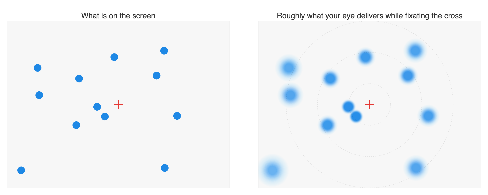
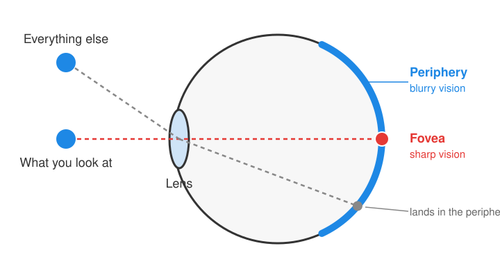
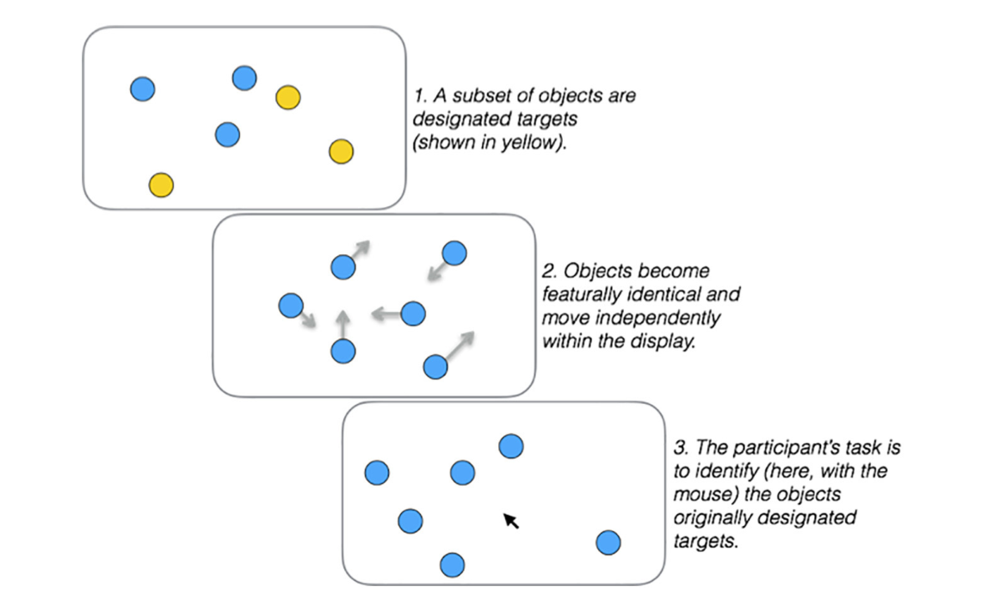
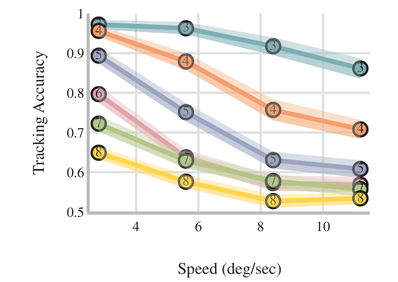
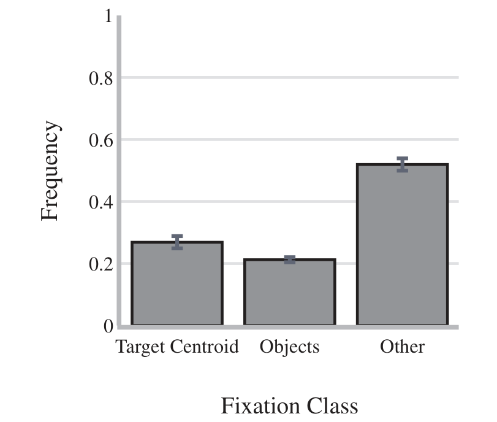
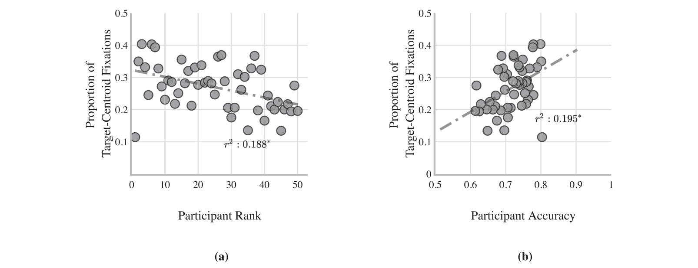
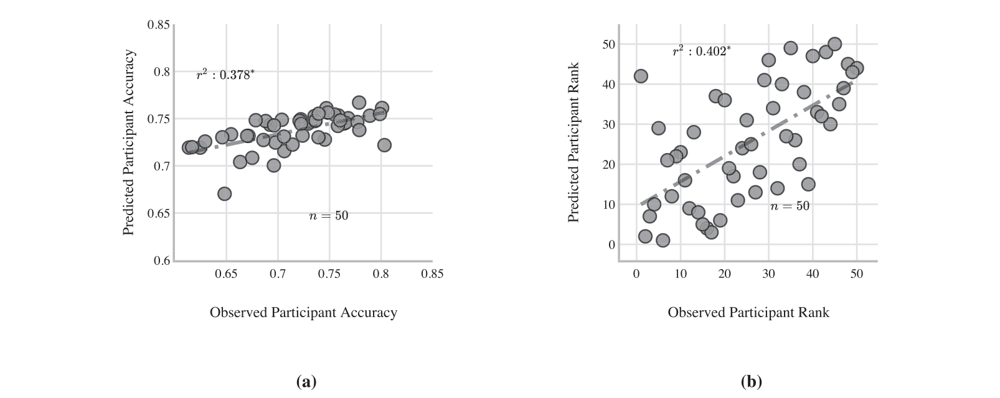
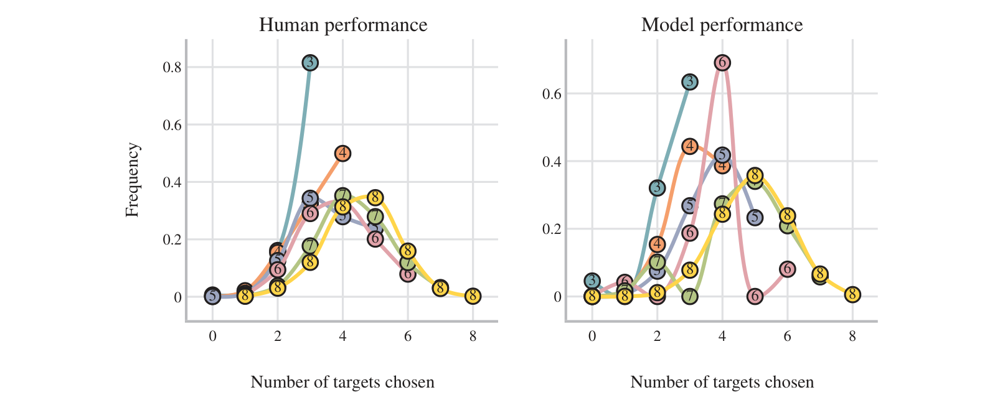

# Where you look decides how many things you can track

Some people can follow six moving things at once and others lose track at three. The usual story blames a limited mind. A model that borrows each person's eye movements tells a simpler one.

{ .post-hero }

<!-- more -->

Ever wondered why we sometimes cannot keep track of things, even when we are trying hard?
Watch a street magician shuffle three cups and try to follow the one with the ball. Most
people lose it. Now imagine following four cups, or six. Intuitively, it might seem that
the mind has only so much room to keep track of several things at once, and that is why it
feels so effortful. There is research that speaks to this idea. Studies of visual working
memory suggest we can hold only a few objects in mind at a time, and that the more we try
to hold, the less clearly we hold each one.[^1] But we do not have a good answer on what
these resources are, or what that effort means. My first paper, written with Jonathan
Flombaum at Johns Hopkins, argued for a simpler and more concrete answer: a lot of the
difference between good and bad trackers comes down to where they point their eyes, and
when.

<figure markdown="span">
  { .headshot }
  <figcaption><a href="https://pbs.jhu.edu/directory/jonathan-flombaum/">Jonathan Flombaum</a> <small>Psychological & Brain Sciences, Johns Hopkins</small></figcaption>
</figure>

[^1]:
    If you want to read more: Zhang & Luck (2008), Discrete fixed-resolution
    representations in visual working memory, *Nature*,
    [doi:10.1038/nature06860](https://doi.org/10.1038/nature06860); and
    Alvarez & Cavanagh (2004), The capacity of visual short-term memory is set both by
    visual information load and by number of objects, *Psychological Science*,
    [doi:10.1111/j.0963-7214.2004.01502006.x](https://doi.org/10.1111/j.0963-7214.2004.01502006.x).

<figure markdown="span">
  <iframe src="https://giphy.com/embed/NusOH30J7QiJy" width="480" height="270" frameborder="0" class="giphy-embed" allowfullscreen title="Cat watching a shell game"></iframe>
  <figcaption>Even a cat knows the game. Keeping track of the right cup is the whole problem. Animation via <a href="https://giphy.com/gifs/NusOH30J7QiJy">GIPHY</a>.</figcaption>
</figure>

## The puzzle

The human eye is not a camera. Only a tiny patch at the center of your gaze, the fovea,
sees sharply. Everything else is blurry, and it gets blurrier the farther it is from where
you are looking. This is why you fixate a word to read it and fixate a face to recognize
it. For most of what we do, the rule "look at the thing you care about" works.

<figure markdown="span">
  
  <figcaption>Whatever you look at lands on the fovea, the one small spot on the retina that sees sharply. Everything else lands in the periphery and is seen blurrily. Illustration by the author.</figcaption>
</figure>

<figure markdown="span">
  
  <figcaption>The same dots as the eye delivers them. Only what is near the cross is crisp. Illustration by the author.</figcaption>
</figure>

But what if you care about several things at once, and they are all moving?

Psychologists study this with a task called multiple object tracking. A handful of
identical dots appear on a screen. A few of them flash to mark them as targets. Then every
dot turns the same color and they all drift around for ten seconds, bouncing off each other
and off the walls. At the end you click on the dots you think were the targets.

<figure markdown="span">
  { width="560" }
  <figcaption>One trial of multiple object tracking. Figure 1 from Upadhyayula & Flombaum (2020), <em>Cognition</em>.</figcaption>
</figure>

Almost everyone can manage three or four. Almost nobody can manage seven or eight. And
some people are reliably much better at it than others. For decades, both facts were
explained in the same spirit: some internal budget of attention or memory that runs out.

## Where do people actually look?

Here is the thing about tracking several moving dots. You cannot look at all of them.
Looking at one means the others fall into your blurry periphery. So the best place to
look is often nowhere in particular: an empty patch of screen that keeps all the targets
reasonably close to the center of your vision. Earlier studies had noticed that people do
sometimes look at the "centroid," the average position of the targets.[^2]

[^2]:
    Fehd & Seiffert (2008), Eye movements during multiple object tracking: Where do
    participants look?, *Cognition*,
    [doi:10.1016/j.cognition.2007.11.008](https://doi.org/10.1016/j.cognition.2007.11.008);
    Fehd & Seiffert (2010), Looking at the center of the targets helps multiple object
    tracking, *Journal of Vision*, [doi:10.1167/10.4.19](https://doi.org/10.1167/10.4.19);
    and Zelinsky & Neider (2008), An eye movement analysis of multiple object tracking in a
    realistic environment, *Visual Cognition*,
    [doi:10.1080/13506280802000752](https://doi.org/10.1080/13506280802000752).

We recorded the eye movements of 50 people while they did 120 tracking trials each, with
three to eight targets moving at four different speeds. Every participant saw exactly the
same trials, which matters for what comes later.

<figure markdown="span">
  { width="440" }
  <figcaption>The usual picture: more targets and faster motion both hurt. Each line is a different number of targets. Figure 4 from Upadhyayula & Flombaum (2020), <em>Cognition</em>.</figcaption>
</figure>

The first thing we confirmed is that tracking skill is a stable trait. People who did
well on slow trials also did well on fast ones, and people who did well with few targets
also did well with many. Whatever separates good trackers from poor ones is consistent.

The second thing surprised us. When we looked at where people fixated, fewer than half of
their fixations landed on either a target or the centroid. Most of the time people were
looking at empty space that was not the centroid.

<figure markdown="span">
  
  <figcaption>Where the eyes spend their time. "Other" means empty space that is not the centroid. Figure 6 from Upadhyayula & Flombaum (2020), <em>Cognition</em>.</figcaption>
</figure>

<figure markdown="span">
  
  <figcaption>Better trackers do look at the centroid a bit more, but that explains only a fifth of the differences between people. Figure 7 from Upadhyayula & Flombaum (2020), <em>Cognition</em>.</figcaption>
</figure>

Good trackers did spend a bit more time near the centroid than poor trackers, but that
explained only about a fifth of the difference between people. How much people moved
their eyes around explained about the same. Simple labels like "looks at the centroid"
or "looks at the objects" clearly were not capturing what skilled trackers were doing.

??? note "More details about the experiment"

    Fifty Johns Hopkins undergraduates each did 120 trials. We built the trials ahead of
    time so everyone saw the same ones, in a different random order. There were six target
    counts (3 to 8, always with an equal number of distractors) and four speeds (2.8 to
    11.2 degrees of visual angle per second). Each trial moved for 10 seconds. An EyeLink
    1000 eye tracker recorded gaze, which we lined up with the screen's 60 frames per
    second, giving 600 gaze positions per trial.

    To check that skill was stable, we split each person's trials in two ways. Accuracy
    on slow trials predicted accuracy on fast trials (r² = 0.78), and accuracy with few
    targets predicted accuracy with many (r² = 0.57). We counted a fixation as "on the
    centroid" or "on an object" only if it fell within 4 degrees of one. Fewer than half
    of fixations qualified, and fewer than a fifth with a stricter 2 degree rule. Time
    spent on the centroid explained 19% of the differences in rank between people, and
    how widely the eyes wandered explained 20%.

## A model that borrows your eyes

Instead of trying to guess what strategy each person was using, we built a computer model
that does the tracking task itself, and then handed it each participant's real eye
movements.

<figure markdown="span">
  
  <figcaption>The model follows each target with a Kalman filter. Its view of a target gets noisier the farther that target is from wherever the participant happened to be looking at that moment. Schematic by the author.</figcaption>
</figure>

The model is deliberately simple. Twenty times a second it receives a noisy snapshot of
where every dot is. It keeps a running estimate of each target's position and velocity,
predicts where the target will be next, and then matches the new snapshot to its
predictions. The dots are identical, so it has to work out which observation belongs to
which target, and it does that by finding the assignment that moves everything the least.
This is the same kind of math that tracks aircraft on radar.

The one twist is the noise. A dot that is close to the participant's current fixation
gives the model a precise observation. A dot far out in the periphery gives a blurry one.
So when the model plays a trial "as" participant 17, it sees what participant 17's eyes
made available at every moment, and nothing else.

<figure markdown="span">
  <video controls loop muted playsinline preload="metadata"
         poster="../../assets/images/blog/mot-model-demo-poster.jpg"
         width="960" height="720"
         aria-label="Animation of the model tracking targets on one trial, with the participant's eye position shown as a red marker and the model's uncertainty about each object drawn as a circle">
    <source src="../../assets/images/blog/mot-model-demo.webm" type="video/webm">
    <source src="../../assets/images/blog/mot-model-demo.mp4" type="video/mp4">
    <a href="../../assets/images/blog/mot-model-demo.mp4">Model demo video</a>
  </video>
  <figcaption>The model tracking one trial using a real participant's eye position, shown as the red "eye" marker. Orange discs are the objects the model currently believes are targets. Blue diamonds show the model's posterior probabilities, its running estimate of where each target should be. Watch what happens when a target drifts far from the eye while a distractor passes close by. The blurry input is enough for the model to swap them, which is a simple way for anyone to make an error. Played at four times real speed. Use the controls to replay or scrub. Animation by the author.</figcaption>
</figure>

Crucially, we did not tune anything to fit the data. The noise formula and the sampling
rate came from earlier vision research and were the same for everyone. The model had no
attention limit, no memory limit, and no idea who was a good tracker. The only thing that
changed from one simulated participant to the next was the sequence of fixations.

??? note "More details about the implementation"

    Each target gets its own Kalman filter, a standard tool for tracking something you
    can only observe noisily. The filter stores a best guess of the target's position and
    speed, assumes it keeps moving in a straight line, and corrects that guess whenever a
    new observation arrives. Observations arrive 20 times a second, a rate borrowed from
    studies of how quickly attention samples the world.

    Each observation is the true position plus random error. The size of that error grows
    with distance from the fixation: the standard deviation is 0.08 × (1 + 0.42 × E),
    where E is how many degrees away from the fixation the object is. That formula comes
    from earlier measurements of how vision degrades in the periphery (Carrasco et al.,
    1995; Rovamo & Virsu, 1979).

    Because the dots are identical, the model gets a bag of unlabeled positions each time.
    It matches them to its predicted targets by finding the pairing with the smallest total
    distance, using a standard assignment algorithm. We ran every trial 100 times per
    participant with fresh random noise and averaged the results. We did not fit any
    parameter to any person.

## What the model told us

Given only where people looked, the model predicted how well each of them tracked. It
picked out the strong trackers from the weak ones, and it ranked the 50 participants in
roughly the right order. On individual trials the fit was even tighter: trials that were
hard for people were hard for the model, and trials that were easy were easy for both.

<figure markdown="span">
  
  <figcaption>Predicted versus observed accuracy (left) and rank (right) for each of the 50 participants. The model never saw anyone's answers. It only saw their eyes. Figure 11 from Upadhyayula & Flombaum (2020), <em>Cognition</em>.</figcaption>
</figure>

We then ran a control that I still find satisfying. We fed the model each person's
fixations in reverse order, so it saw the same places but at the wrong times. The
predictions collapsed to a fraction of their former strength. Being a good tracker is not
just about picking good places to look. It is about looking at the right place at the
right moment, as targets drift toward distractors and the risk of confusing them rises
and falls.

??? note "More details about the results"

    The model's predictions explained 38% of the differences in accuracy between people
    and 40% of the differences in their rank, both well beyond chance. Trial by trial the
    match was much tighter: 82% across all 6,000 person-by-trial combinations, and 83%
    across the 120 trials once averaged over people. When we reversed the order of each
    person's fixations, the model explained only about 20% of the differences between
    people. The individual-level numbers are roughly half of how consistent people were
    with themselves, so there is room for a better model to explain more.

## Limits that nobody built in

This is the part of the paper I like most. The model had no capacity limit. It could
represent eight targets at once without complaint. Yet look at what it did when we
counted how many targets it got right on each trial.

<figure markdown="span">
  
  <figcaption>How often people (left) and the model (right) correctly picked a given number of targets, for each target load. Both pile up around four and almost never reach seven or eight. Figure 10 from Upadhyayula & Flombaum (2020), <em>Cognition</em>.</figcaption>
</figure>

People mostly got about four targets right no matter how many they were asked to track,
and essentially never got seven or eight. So did the model. Nobody programmed a limit of
four into it. The limit emerged on its own, from the ordinary uncertainty of blurry,
sampled input and the growing chance of mixing up identical objects as they crowd together.
Some of what looks like a hard cap on the mind turns out to be the ordinary consequence of
an eye that sees clearly only in one place.

## Why this matters

That reframes what it means to be bad at tracking. Saying someone "has less attention" is
a description dressed up as an explanation. Saying they looked in the wrong places at the
wrong times is something you can measure, model, and in principle train.

The model still had room to improve. It outperformed humans overall, because it never
gives up on a target or guesses, and real people do both. It also captured only about
half of the reliable individual differences. But it did that with zero free parameters,
which convinced me that the eyes are carrying a large part of the story.

*Upadhyayula & Flombaum (2020). A model that adopts human fixations explains individual
differences in multiple object tracking. Cognition.*
[:material-file-document: Paper](../../files/papers/MOT_paper.pdf) ·
[:material-github: Code](https://github.com/Adibuoy23/Multiple-Object-Tracking) ·
[:material-database: Data](https://doi.org/10.17632/h5zgzrfkxr.2)

---

<small>
**Figure credits.** Shell game animation via [GIPHY](https://giphy.com/gifs/NusOH30J7QiJy).
Figures 1, 4, 6,
7, 10, and 11 are reproduced from Upadhyayula & Flombaum (2020), *Cognition*,
[doi:10.1016/j.cognition.2020.104418](https://doi.org/10.1016/j.cognition.2020.104418).
The eye diagram, the blur illustration, the model schematic, and the model demo animation are by the author. The headshot is the faculty portrait from the Johns Hopkins [Psychological & Brain Sciences](https://pbs.jhu.edu/directory/jonathan-flombaum/) directory.
</small>
