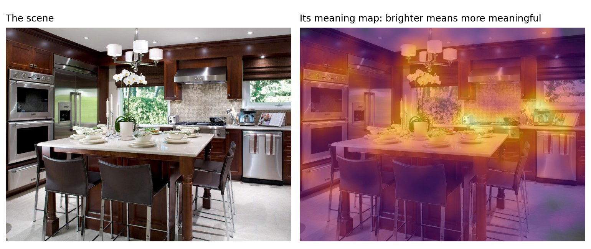
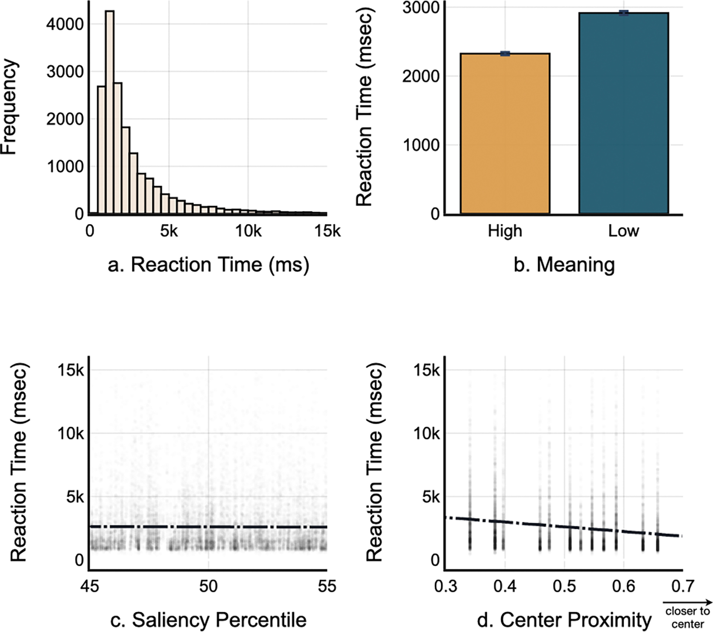
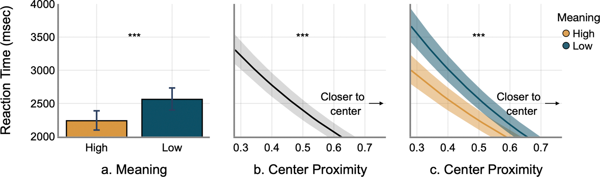

# Why you cannot spot the difference

Two photos, one small change, and you stare for ages before you find it. The reason is that your visual system does not keep a copy of the picture. It keeps a summary of what things mean, and a change to a meaningful part of the scene is caught much faster than a change to a meaningless one.

{ .post-hero }

<!-- more -->

Everyone has done a spot-the-difference puzzle. Two nearly identical pictures sit side
by side, you are told there are five differences, and you find three of them in a few
seconds and the last two only after an embarrassingly long search. The puzzle works
because of a quirk of vision that psychologists call **change blindness**. If the change
happens while you are looking straight at it, you see it at once, because motion grabs
the eye. Take the motion away, by putting the two pictures apart, or by inserting a blank
screen between them, or by making the change during a blink or an eye movement, and even
a large change can go unnoticed for a surprisingly long time.[^cb]

[^cb]:
    Rensink, O'Regan & Clark (1997), To see or not to see: The need for attention to
    perceive changes in scenes, *Psychological Science*,
    [doi:10.1111/j.1467-9280.1997.tb00427.x](https://doi.org/10.1111/j.1467-9280.1997.tb00427.x).
    Change blindness during eye movements and blinks came up in my
    [film post](why-you-miss-it-when-a-movie-skips.md) as well.

Change blindness is not just a party trick. It is a window into what the visual system
keeps in memory from one moment to the next. If you noticed every change, we would
conclude that you store something like a photograph and compare it against the next one.
You do not notice every change, so whatever is stored must be sparser than a photograph.
The interesting question is what survives. Which parts of a scene does the visual system
bother to hold on to?

## Meaning, measured

The long-standing suspicion is that meaning survives. Studies going back decades found
that changes to the "interesting" parts of a scene, or to objects that do not belong in
it, are caught faster.[^classic] The trouble with that evidence is the word "interesting."
Someone had to decide which regions were interesting, and that judgment could smuggle in
all sorts of things: contrast, color, edges, how central the region is, or simply how
big the object is. To say that *meaning* drives change detection, you need a way to
measure meaning that is separate from all of that.

[^classic]:
    Hollingworth & Henderson (2000), Semantic informativeness mediates the detection of
    changes in natural scenes, *Visual Cognition*,
    [doi:10.1080/135062800394775](https://doi.org/10.1080/135062800394775); Stirk &
    Underwood (2007), Low-level visual saliency does not predict change detection in
    natural scenes, *Journal of Vision*, [doi:10.1167/7.10.3](https://doi.org/10.1167/7.10.3).

That is what **meaning maps** provide. John Henderson and Taylor Hayes developed them in
2017.[^mm] A photograph is cut into a few hundred overlapping circular patches, at two
sizes. Each patch is shown on its own, out of context, to many people, who rate how
meaningful it is on a six-point scale. Average the ratings, smooth them, and you get a
heat map of where the meaning is in the scene. The map is simply the aggregated response
of many people about all the places in the image they found meaningful.

[^mm]:
    Henderson & Hayes (2017), Meaning-based guidance of attention in scenes as revealed
    by meaning maps, *Nature Human Behaviour*,
    [doi:10.1038/s41562-017-0208-0](https://doi.org/10.1038/s41562-017-0208-0).

<figure markdown="span">
  
  <figcaption>A meaning map for the demonstration scene from the study, built from ratings of small patches by many people. The stove, the counter, and the appliances score high. The ceiling, the walls, and the floor score low. Prepared by the author from the study materials.</figcaption>
</figure>

The natural control comparison is a **saliency map**, which is computed from the image
itself, with no people involved, and marks where the contrast, color, and edges are
strongest. Meaning and saliency share a good deal of information, since meaningful
objects often have strong edges, so a region that people find meaningful will often be
salient as well. To ask whether meaning does anything on its own, the study had to hold
saliency constant and vary meaning, which is what the design below does.

## The experiment

Alan Lu and I designed and ran this study together in John Henderson's lab at UC Davis.
We built it around a classic flicker task. A photograph of a scene flashes for about
a quarter of a second, a grey screen for a fraction of that, then the photograph again
with one region altered, then grey, and so on, back and forth. There is no motion to give
the change away. Your job is to press the space bar the moment you spot it, then click on
where it was.

<figure markdown="span">
  
  <figcaption>One trial. The original and altered pictures alternate with a grey mask between them until the viewer presses a key, then the viewer clicks where the change was. Figure 1 from Lu, Upadhyayula & Henderson (2025), <em>Visual Cognition</em>.</figcaption>
</figure>

Three design choices did the work.

- **Two changes per scene, matched for saliency.** For each of 196 photographs we picked
  two patches: the most meaningful one and the least meaningful one, according to the
  meaning map. But we chose them only from patches whose saliency fell in a narrow
  middle band, so the two locations looked equally "interesting" to a camera, and
  differed only in how meaningful people found them.
- **A change that has no low-level signature.** Instead of adding or removing an object,
  we warped the patch with a diffeomorphic transformation, a smooth distortion that
  keeps the colors, brightness, and edge statistics of the original but scrambles what
  it depicts. Earlier work had shown that meaning maps notice this kind of distortion
  and saliency models do not.[^diffeo]
- **Center bias, measured and controlled.** People look at the middle of pictures first,
  so a change near the center is found faster whatever it means. We recorded how far
  each change was from the center and took that out statistically.

<figure markdown="span">
  
  <figcaption>How the two change locations were chosen. The scene is cut into overlapping patches, avoiding the center (1). People's ratings give the meaning map (2). Only patches whose computed saliency falls in a narrow middle band are kept (3), and from those the most and the least meaningful are chosen (4). Each is then warped to make the two altered versions of the scene (5). Saliency is illustrated schematically. Prepared by the author from the study materials.</figcaption>
</figure>

[^diffeo]:
    Stojanoski & Cusack (2014), Time to wave good-bye to phase scrambling: Creating
    controlled scrambled images using diffeomorphic transformations, *Journal of Vision*,
    [doi:10.1167/14.12.6](https://doi.org/10.1167/14.12.6); Hayes & Henderson (2022),
    Meaning maps detect the removal of local semantic scene content but deep saliency
    models do not, *Attention, Perception & Psychophysics*,
    [doi:10.3758/s13414-021-02395-x](https://doi.org/10.3758/s13414-021-02395-x).

Nearly two hundred people did the task online. Changes in the meaningful patches were
found faster, by about 600 milliseconds in the raw averages, and by a little over 300
milliseconds once the center bias was taken out. That is a large effect for a task where
the two locations were, to a camera, indistinguishable.

<figure markdown="span">
  
  <figcaption>Raw results from the first experiment. High-meaning changes are found faster (b), saliency makes no difference across the matched band (c), and changes near the center are found faster (d). Figure 2 from Lu, Upadhyayula & Henderson (2025), <em>Visual Cognition</em>.</figcaption>
</figure>

<figure markdown="span">
  
  <figcaption>The same data after the statistical model accounts for center bias. The meaning advantage survives, and it grows the farther the change is from the center (c). Figure 3 from Lu, Upadhyayula & Henderson (2025), <em>Visual Cognition</em>.</figcaption>
</figure>

One detail in the last panel is worth a pause. The meaning advantage was largest for
changes far from the center. Near the middle, where attention lands anyway, meaning
hardly mattered. Out at the edges, where the visual system has to choose what to bother
with, it leaned on meaning to decide.

??? note "More details about the first experiment"

    Of 240 UC Davis undergraduates, 196 were kept after excluding anyone below 80%
    detection accuracy or with incomplete data. The 196 scenes came from Henderson &
    Hayes (2018), half indoor and half outdoor, with no people or animals, shown at 700 by
    525 pixels in a browser via jsPsych. Images alternated for 240 ms each with an 80 ms
    grey mask, for up to 15 s. Candidate patches were 205 pixels across, excluded from the
    center and edges, and filtered to the 45th to 55th saliency percentiles before picking
    the highest- and lowest-meaning patch. Distortions used the default diffeomorphic
    parameters and were blended at the edges. Reaction times were modeled with a gamma
    mixed model on correct trials with scene and participant intercepts. Mean times were
    2,325 ms for high-meaning and 2,915 ms for low-meaning changes; the model gave a
    meaning effect of b = 0.13, a center proximity effect of b = −1.33, and an
    interaction of b = −0.30, all p < .001, with an adjusted advantage of 323 ms.

## Try it yourself

Below is the task itself, trimmed to six pictures. In three of them the change sits in a
more meaningful region of the scene and in three a less meaningful one, always chosen
among regions of matched saliency, and the feedback tells you which was which. Most
people find the more meaningful ones noticeably faster.

<figure markdown="span" class="demo-frame" data-demo-frame>
  <iframe src="/demos/meaning-flicker/index.html" title="Flicker change detection demo" allow="autoplay" style="aspect-ratio: 700 / 640;"></iframe>
  
    <button type="button" class="md-button md-button--primary" data-demo-start>Start</button>
    <button type="button" class="md-button" data-demo-pause>Pause</button>
  
  <figcaption>How to play. Press Start and read the one-page instructions. A picture flickers, and one small region is distorted in every other flash. Press the <strong>space bar</strong> as soon as you spot it, then click where it was. You will see whether you were right and whether the change came from a more or a less meaningful region, among regions of matched saliency. Six pictures, about a minute in all. Use a desktop browser in a large window. The demo is a trimmed copy of Alan Lu's original, with the same task and pictures.</figcaption>
</figure>

## Turning the world upside down

A skeptic could still say that "meaning" is just some unmeasured low-level feature that
the raters were responding to. So the second experiment ran the whole thing again with
every photograph upside down. Inversion is a standard trick in this line of work: it
changes nothing about the pixels, the contrast, or the edges, but it makes scenes much
harder to understand. If the meaning advantage comes from understanding, inversion
should shrink it. If it comes from something in the pixels, inversion should leave it
alone.

It shrank. With inverted scenes everyone was slower overall, by around 400
milliseconds, which is itself a sign that understanding the scene helps you find changes
in it. And the meaning advantage dropped from about 320 milliseconds to about 140. The
part of the effect that inversion removed is the part that depended on knowing what you
were looking at.

<figure markdown="span">
  { width="640" }
  <figcaption>Both experiments together. Inversion slows everything (c), and it narrows the gap between high- and low-meaning changes (d). Figure 6 from Lu, Upadhyayula & Henderson (2025), <em>Visual Cognition</em>.</figcaption>
</figure>

??? note "More details about the second experiment"

    A fresh 240 undergraduates took part, with 189 kept after the same exclusions.
    Everything else matched the first experiment except that the images were rotated by
    180 degrees. Mean times were 2,768 ms for high-meaning and 3,205 ms for low-meaning
    changes, about 400 ms slower than upright. The adjusted meaning advantage was about
    140 ms. In a combined model of both experiments, inversion slowed detection
    (b = 0.20) and, critically, interacted with meaning (b = −0.08, p < .001), with no
    interaction between inversion and center proximity. Earlier work had reported the
    inversion cost alone.[^inv]

[^inv]:
    Shore & Klein (2000), The effects of scene inversion on change blindness, *The
    Journal of General Psychology*,
    [doi:10.1080/00221300009598569](https://doi.org/10.1080/00221300009598569).

## What this says about seeing

Put the two experiments together and the answer to the opening question is fairly
clear. What the visual system holds from one glance to the next is not a copy of the
picture. It is weighted by meaning. Change something in a part of the scene that people
find meaningful and the change is noticed sooner, even when that part is no more
eye-catching than any other, even when the change
itself has no low-level fingerprint, and more so the farther the change sits from the
center of the picture. Take away the ability to understand the scene, and much of that
advantage goes with it.

There is a link to attention here. The same meaning maps were originally built to
predict where people look when they view a scene, and they do that well. Now the same
maps predict which changes people catch. That suggests attention and change detection are
drawing on the same map of the world, and it fits with the long-standing finding that
changes at attended locations are noticed and changes elsewhere are missed.

There is a puzzle left open. Meaning maps score patches of space, not objects. Whether
the visual system really tracks meaning as a spatial density, or tracks objects and their
meanings and the patches just inherit that, is something this design cannot separate,
and it is a question for future studies.

<figure markdown="span">
  { .headshot }
  <figcaption><a href="https://viscoglab.ucdavis.edu/people/alan-lu">Alan Lu</a> <small>Visual Cognition Lab, UC Davis</small></figcaption>
</figure>

<figure markdown="span">
  { .headshot }
  <figcaption><a href="https://mindbrain.ucdavis.edu/people/john-henderson">John M. Henderson</a> <small>Center for Mind and Brain, UC Davis</small></figcaption>
</figure>

*Lu, Upadhyayula & Henderson (2025). Meaning maps predict reaction time in change
detection. Visual Cognition, 33, 89–104.*
[:material-file-document: Paper](https://doi.org/10.1080/13506285.2025.2507946) ·
[:material-lock-open-variant: Free full text](https://pmc.ncbi.nlm.nih.gov/articles/PMC12380198/) ·
[:material-database: Data](https://osf.io/3qv9c/) ·
[:material-play-circle: Try the task](https://alanzhihaolu.github.io/changeBlindness/FChange/demo/)

[:material-flask-outline: This work in the research section: What drives change blindness in naturalistic scenes?](../../research/perceived/what-drives-change-blindness-in-naturalistic-scenes.md)

---

<small>
**Figure credits.** The opening picture, the meaning map illustration, and the design
schematic use the demonstration scene from the experiment and were prepared by the author from the study
materials. Figures 1, 2, 3, and 6 are
reproduced from Lu, Upadhyayula & Henderson (2025), *Visual Cognition*,
[doi:10.1080/13506285.2025.2507946](https://doi.org/10.1080/13506285.2025.2507946), via
the author manuscript in PubMed Central. The headshots are from the UC Davis
[Visual Cognition Lab](https://viscoglab.ucdavis.edu/people/alan-lu) and
[Center for Mind and Brain](https://mindbrain.ucdavis.edu/people/john-henderson) pages.
</small>
