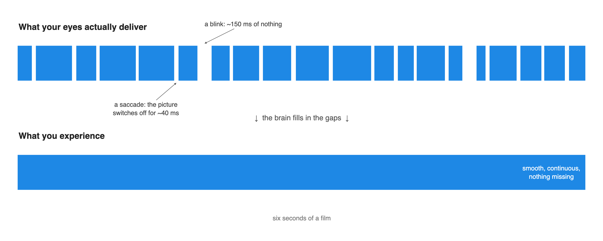
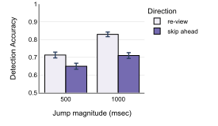
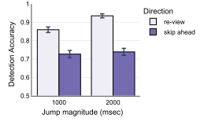
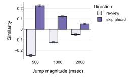
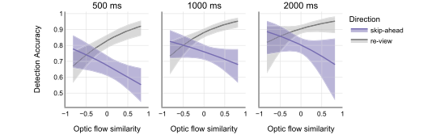
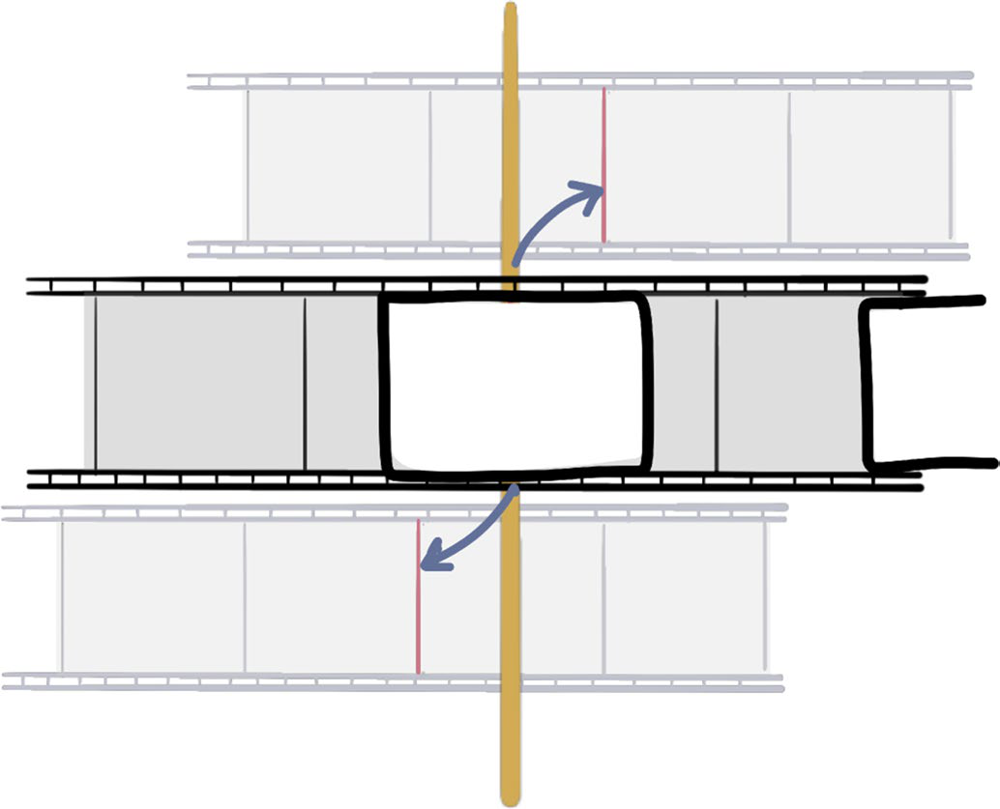
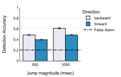

# Why you miss it when a movie skips

Jump a film a full second forward during an eye movement and most people never notice. Jump it backward and they notice more often. Two studies on how vision papers over gaps in time, and why the direction matters.

{ .post-hero }

<!-- more -->

Our visual system is a marvel with some embarrassing flaws. If you have read my earlier
posts on [tracking moving objects](where-you-look-decides-what-you-can-track.md) and on
[the perception of now](what-you-see-as-now-is-not-one-moment.md), you already know this to
be true. The resolution of the retina is anything but uniform: only the fovea, a pinhead of a spot at the center of your gaze,
sees sharply, and everything out in the periphery is a smear. To top that off, we cannot
even sample the world continuously. We blink, thousands of times a day. And to make up for
the poor resolution out in the periphery, we fling our eyes around several times a second
in rapid jumps called saccades. Here is the strange part. During every one of those saccades the visual
system is effectively paralyzed. Processing shuts down, and for a few tens of milliseconds
nothing useful gets through, a phenomenon called saccadic suppression that has been
studied for half a century.[^suppression] Why would a visual system blink or move so
rapidly if it goes blind each time? One school of thought is that these brief blackouts
are not wasted. They give the eye and the brain a moment to reset and prepare for the
next movement.[^blink] Add it all up and what the eye actually delivers is a patchy,
stuttering, half-blind signal. So how on earth do we end up with such a rich visual
experience?

[^suppression]:
    Matin (1974), Saccadic suppression: A review and an analysis, *Psychological
    Bulletin*, [doi:10.1037/h0037368](https://doi.org/10.1037/h0037368); Burr, Morrone &
    Ross (1994), Selective suppression of the magnocellular visual pathway during saccadic
    eye movements, *Nature*, [doi:10.1038/371511a0](https://doi.org/10.1038/371511a0);
    Ross, Morrone, Goldberg & Burr (2001), Changes in visual perception at the time of
    saccades, *Trends in Neurosciences*,
    [doi:10.1016/S0166-2236(00)01685-4](https://doi.org/10.1016/S0166-2236(00)01685-4).
    For what eye movements do for reading and scene viewing, see Rayner (1998), Eye
    movements in reading and information processing: 20 years of research,
    *Psychological Bulletin*,
    [doi:10.1037/0033-2909.124.3.372](https://doi.org/10.1037/0033-2909.124.3.372), and
    Henderson & Hollingworth (2003), Global transsaccadic change blindness during scene
    perception, *Psychological Science*,
    [doi:10.1111/1467-9280.02459](https://doi.org/10.1111/1467-9280.02459).

[^blink]:
    Nakano, Kato, Morito, Itoi & Kitazawa (2013), Blink-related momentary activation of
    the default mode network while viewing videos, *Proceedings of the National Academy
    of Sciences*, [doi:10.1073/pnas.1214804110](https://doi.org/10.1073/pnas.1214804110).

Think about the last movie you watched. It felt rich, immersive, and continuous. At no
point did you feel your eyes blinking, or notice the picture cutting out because you had
to move them. That is because the brain is pulling another one of its tricks. It is
constantly, silently filling in the missing information, and it does it so well that you
never feel the seams. Which raises a question worth an experiment: if the brain is patching
the picture all the time, how big a hole could you cut in a movie before anyone noticed?

## What could the brain be doing?

There are a few ways to build continuity out of an interrupted signal.

The simplest version is a camera: compare each new snapshot to the last and flag any
difference. If that were how it worked, any change during a gap would jump out at you. It
does not. In a famous study, an experimenter asking a stranger for directions was swapped
for a different person while two workers carried a door between them, and half the
strangers carried on as if nothing had happened.[^door] Film editors rely on the same
blindness, since viewers routinely fail to notice cuts that follow the rules of continuity
editing.[^edit]

[^door]:
    Simons & Levin (1998), Failure to detect changes to people during a real-world
    interaction, *Psychonomic Bulletin & Review*,
    [doi:10.3758/BF03208840](https://doi.org/10.3758/BF03208840).

[^edit]:
    Smith & Henderson (2008), Edit blindness: The relationship between attention and
    global change blindness in dynamic scenes, *Journal of Eye Movement Research*,
    [doi:10.16910/jemr.2.2.6](https://doi.org/10.16910/jemr.2.2.6). On what continuity
    editing does to event perception, see Magliano & Zacks (2011), The impact of
    continuity editing in narrative film on event segmentation, *Cognitive Science*,
    [doi:10.1111/j.1551-6709.2011.01202.x](https://doi.org/10.1111/j.1551-6709.2011.01202.x).

An alternative hypothesis is that the brain is a **prediction engine**. It does not wait for the next moment to arrive and then look at it. It is
constantly generating expectations about what is coming next, and it uses the input
mainly to check those expectations. This is the heart of Jeff Zacks's event segmentation
theory. As you watch something unfold, your brain keeps a running picture of what is
going on and uses it to guess what comes next. Most of the time the guess is right, and
the world simply confirms it. The brain only has to sit up and take notice when the guess
turns out to be wrong.[^est]

[^est]:
    Zacks, Speer, Swallow, Braver & Reynolds (2007), Event perception: A mind-brain
    perspective, *Psychological Bulletin*,
    [doi:10.1037/0033-2909.133.2.273](https://doi.org/10.1037/0033-2909.133.2.273).

<figure markdown="span">
  { width="100%" }
  <figcaption>The prediction engine. A model of the current event predicts what should come next. After a blink, a saccade, or a flicker, the brain checks what arrives against that prediction. A match is bridged silently. A mismatch is an event boundary, and it gets noticed. Diagram by the author.</figcaption>
</figure>

If that is how the brain bridges its own blackouts, it makes a specific prediction about
what you should miss. A gap that lands where the world was going anyway should slip
through, because the input matches the expectation. A gap that puts the world somewhere
it was not heading should stand out, because the expectation fails. Cuts cannot test
this, since they are designed to be invisible and land at moments an editor chose. We
needed disruptions with no editor helping, in the middle of a shot, that could run either
with the flow of the event or against it.

## Jumping a film during an eye movement

For the first study, with John Henderson at the University of California, Davis, we used
the film *1917*. It was shot to look like one continuous take, so there are no cuts to
hide behind. We took 37 one-minute clips, stripped the sound, and had people watch them
while an eye tracker followed their gaze. Their only job was to press a button whenever
the film seemed to jump.

<figure markdown="span">
  { .headshot }
  <figcaption><a href="https://mindbrain.ucdavis.edu/people/john-henderson">John M. Henderson</a> <small>Center for Mind and Brain, UC Davis</small></figcaption>
</figure>

The trick was in the timing. Every few seconds the program waited for a saccade and
switched the video during it, inside the window when vision is suppressed, so the switch
itself was invisible. What changed was where in time the clip was. Sometimes it jumped
ahead, skipping content the viewer had not yet seen. Sometimes it jumped back by the same
amount, replaying content they had just watched. And sometimes it "switched" to the same
moment, which told us how often people pressed the button when nothing had happened. A
forward jump runs with the flow of the event, so a prediction engine should let it
through. A backward jump throws the event into reverse, which no prediction anticipates,
so it should stand out.

<figure markdown="span">
  { width="640" }
  <figcaption>The saccade-contingent design. Three copies of the clip play in step, offset by half a second to two seconds, and only one is visible. The vertical line marks an eye movement. At that instant the visible copy is swapped: back to a frame the viewer has already seen (re-view), forward to one they have not (skip-ahead), or, on control trials, to the same frame (no change). Because the swap happens while vision is suppressed, the only thing that can give it away is the content. Schematic by the author.</figcaption>
</figure>

Two things stood out. First, people missed a lot. Even though they knew the jumps were
coming and were watching for them, they failed to report about a quarter of the jumps in
the first experiment. False alarms were almost nonexistent, so these were real misses.
Second, the direction mattered. Forward skips were missed about ten percent more often
than backward ones, at every size we tested.

<figure markdown="span">
  { width="440" }
  <figcaption>Detection in the first experiment. Skipping ahead hides better than skipping back, at both jump sizes. Figure 2 from Upadhyayula & Henderson (2023), <em>Journal of Vision</em>.</figcaption>
</figure>

A second experiment doubled the jumps to one and two seconds. Two seconds is a long time
in a film. A character can cross a room in two seconds. People still missed jumps of that
size, roughly one in four forward jumps of two full seconds went unreported, and the gap
between forward and backward grew rather than shrank.

<figure markdown="span">
  { width="440" }
  <figcaption>The second experiment, with jumps of one and two seconds. Backward jumps get easier as they grow. Forward jumps barely do. Figure 5 from Upadhyayula & Henderson (2023), <em>Journal of Vision</em>.</figcaption>
</figure>

??? note "More details about the eye tracking experiments"

    Thirty participants in Experiment 1 and 29 in Experiment 2 each watched 35 clips.
    Three versions of every clip played in parallel, one unaltered and two starting 500
    and 1,000 ms later (1,000 and 2,000 ms in Experiment 2), with only one visible. When
    eye velocity exceeded 140 degrees per second, the display switched to another
    version, on average 8.5 ms after the saccade began, well inside the 30 to 40 ms a
    saccade lasts. Each clip contained one jump of each direction and size plus a 0 ms
    control. A press within 2 s counted as a detection. Detection was 67% for
    skip-ahead and 77% for re-view in Experiment 1, and 73% versus 89% in Experiment 2,
    with false alarms of 0.2% and 0.3%. Direction, magnitude, and their interaction were
    all significant in mixed-effects models; saccade duration was not.

## Why forward jumps hide better

If prediction is what hides forward jumps, then a forward jump should hide best when
what arrives after it looks most like what was expected. To test that, we looked at the
video itself. Optic flow is the pattern of motion across the
image from one frame to the next, the thing that tells you the camera is panning left or
a soldier is running toward you. We computed the flow just before and just after every
jump and asked how similar the two were.

<figure markdown="span">
  { width="100%" }
  <figcaption>Motion before and after a forward jump looks alike. Before and after a backward jump it does not. Figure 8 from Upadhyayula & Henderson (2023), <em>Journal of Vision</em>.</figcaption>
</figure>

<figure markdown="span">
  { width="100%" }
  <figcaption>The more alike the motion, the more a forward jump is missed. Backward jumps show the reverse. Figure 9 from Upadhyayula & Henderson (2023), <em>Journal of Vision</em>.</figcaption>
</figure>

The result had a clean shape. Forward jumps left the motion pattern much as it was, since
a pan or a run continues in the same direction. Backward jumps reversed it. And for
forward jumps, the more similar the motion before and after, the more often people missed
the jump. When the world arrives looking the way you expected it to look, you do not
notice that you skipped the part in between. Something is being predicted.

## Taking the eyes out of it

There was a loose end. Every jump in the first study happened during a saccade the viewer
chose to make, and eye movements are not random. A viewer who gets bored, or who looks
away from the action, might be exactly the viewer who misses a jump. Perhaps the result
was about the eyes rather than about the visual system bridging gaps in general.

So in the second paper we removed the eyes from the design. We ran the study online with
no eye tracker. Instead, every two seconds the screen went white for 150 milliseconds, a
flicker, and during some flickers the film jumped forward or backward. The timing was set
by us, not by the viewer, and everyone saw the jumps at the same moments. If the bridging
is something the visual system does whenever its input is interrupted, the same pattern
should appear with a flicker as with a saccade.

<figure markdown="span">
  { width="560" }
  <figcaption>The flicker version. A white screen appears for 150 ms every two seconds, and occasionally the film jumps across one. Figure 1 from Upadhyayula & Henderson (2024), <em>Attention, Perception & Psychophysics</em>.</figcaption>
</figure>

It did, and the numbers got worse. People now caught only about half of the jumps.
Forward jumps were again missed more than backward ones, by ten points in the first
experiment and seventeen in the second, and the difference again survived jumps of two
full seconds. Whatever is filling the gaps does not care whether the gap came from an eye
movement or from a blank screen. It is the visual system intelligently bridging an
interruption with what it expects to see next.

<figure markdown="span">
  { width="100%" }
  <figcaption>Flicker experiment 1. The dashed line is the false alarm rate. Figure 2 from Upadhyayula & Henderson (2024), <em>Attention, Perception & Psychophysics</em>.</figcaption>
</figure>

<figure markdown="span">
  { width="100%" }
  <figcaption>Flicker experiment 2, with jumps of one and two seconds. Figure 4 from Upadhyayula & Henderson (2024), <em>Attention, Perception & Psychophysics</em>.</figcaption>
</figure>

??? note "More details about the flicker experiments"

    Sixty-six participants in each experiment did the task in a browser, built in jsPsych,
    with the same *1917* clips scaled to 463 by 240 pixels. A white mask covered the video
    for 150 ms every 2,000 ms. Jumps of 500 or 1,000 ms (Experiment 1) or 1,000 or 2,000 ms
    (Experiment 2) occurred during some flickers, 4 to 6 s apart, with a 0 ms control.
    A press within 1.75 s counted. Detection was 44% forward versus 54% backward in
    Experiment 1, and 43% versus 60% in Experiment 2. Larger jumps were easier in both.
    False alarms ran about 21%, giving a d′ of 0.43. Curiously, this is the reverse of
    an earlier finding that luminance changes are easier to catch across flickers than
    across saccades,[^lum] which suggests jump detection leans on higher-level
    information than a change in brightness does.

[^lum]:
    Henderson, Brockmole & Gajewski (2008), Differential detection of global luminance
    and contrast changes across saccades and flickers during active scene perception,
    *Vision Research*,
    [doi:10.1016/j.visres.2007.10.008](https://doi.org/10.1016/j.visres.2007.10.008).

## Try it yourself

Below is the actual experiment, trimmed to two one-minute clips, and most people are
surprised by how many jumps get past them. The film footage is copyrighted, so the clips
here come from the META stimulus set, a library of everyday activities filmed in Jeff
Zacks's lab for studying event cognition.[^meta]

<figure markdown="span" class="demo-frame" data-demo-frame>
  <iframe src="/demos/flicker/index.html" title="Flicker paradigm demo" allow="autoplay"></iframe>
  
    <button type="button" class="md-button md-button--primary" data-demo-start>Start</button>
    <button type="button" class="md-button" data-demo-pause>Pause</button>
  
  <figcaption>How to play. Press Start, then keep your eyes on the video. The screen will flicker every two seconds. During some flickers the clip jumps forward or backward in time. Press the <strong>space bar</strong> as soon as you notice a jump. Pause and Resume stop the clock if you need a moment. You will get a word of feedback after each press and after each jump you miss. Two clips, about a minute each. Use a desktop browser in a large window; the timing does not survive a phone screen. The clips are everyday activities from the META stimulus set, since the film footage is copyrighted.</figcaption>
</figure>

[^meta]:
    Bezdek, Nguyen, Hall, Braver, Bobick & Zacks (2022), The multi-angle extended
    three-dimensional activities (META) stimulus set: A tool for studying event cognition,
    *Behavior Research Methods*,
    [doi:10.3758/s13428-022-01980-8](https://doi.org/10.3758/s13428-022-01980-8).

## The takeaway

The continuity you experience when you watch a film is not in the film. It is built, and
the builder is a prediction engine. It carries forward where the event was heading, which
is why forward jumps slip through when the world arrives looking roughly as predicted, and
why backward jumps, which run the event in reverse, get caught. That is not a defect. It is the same
machinery that hides every blink and every saccade of your day, and it is working
whether the interruption comes from your own eyes or from a flickering screen.

When the second paper came out, the Psychonomic Society chose it for a feature by Melinh
Lai, who opened by confessing a lifetime of being accused of laziness "when really I've
been hard at work watching TV and movies." Her closing line is the one I would want you to
walk away with: "lying around watching TV isn't a waste. Our visual systems are hard at
work." So the next time you feel lazy for watching a movie, think about how much
intelligent work your brain is doing to make it look continuous.[^lai]

[^lai]:
    Lai, M. K. (2024, April 3). [Now you don't see me, and now you still don't see me:
    Detecting movie skips using a flicker paradigm](https://featuredcontent.psychonomic.org/now-you-dont-see-me-and-now-you-still-dont-see-me-detecting-movie-skips-using-a-flicker-paradigm/).
    *Psychonomic Society Featured Content*.

*Upadhyayula & Henderson (2023). Spatiotemporal jump detection during continuous film
viewing. Journal of Vision.*
[:material-file-document: Paper](../../files/papers/Spatiotemporal_saccade_paper.pdf) ·
[:material-database: Data & materials](https://osf.io/j95z3/)

*Upadhyayula & Henderson (2024). Spatiotemporal jump detection during continuous film
viewing: Insights from a flicker paradigm. Attention, Perception & Psychophysics.*
[:material-file-document: Paper](https://rdcu.be/du6GP) ·
[:material-database: Data & materials](https://osf.io/296jh/) ·
[:material-newspaper-variant-outline: Psychonomic Society feature](https://featuredcontent.psychonomic.org/now-you-dont-see-me-and-now-you-still-dont-see-me-detecting-movie-skips-using-a-flicker-paradigm/)

---

<small>
**Figure credits.** The opening timeline, the saccade-contingent schematic, and the prediction engine diagram are by the author. Figures 2, 5, 8, and 9 are
reproduced from Upadhyayula & Henderson (2023), *Journal of Vision*,
[doi:10.1167/jov.23.2.13](https://doi.org/10.1167/jov.23.2.13), published under a
CC BY 4.0 license. Figures 1, 2, and 4 are reproduced from Upadhyayula & Henderson (2024),
*Attention, Perception & Psychophysics*,
[doi:10.3758/s13414-023-02837-8](https://doi.org/10.3758/s13414-023-02837-8),
© The Psychonomic Society. The demo clips are from the META stimulus set (Bezdek et al.,
2022). Quotations are from Melinh K. Lai's Psychonomic Society feature, linked above. The
headshot is the faculty portrait from the UC Davis
[Center for Mind and Brain](https://mindbrain.ucdavis.edu/people/john-henderson).
</small>
