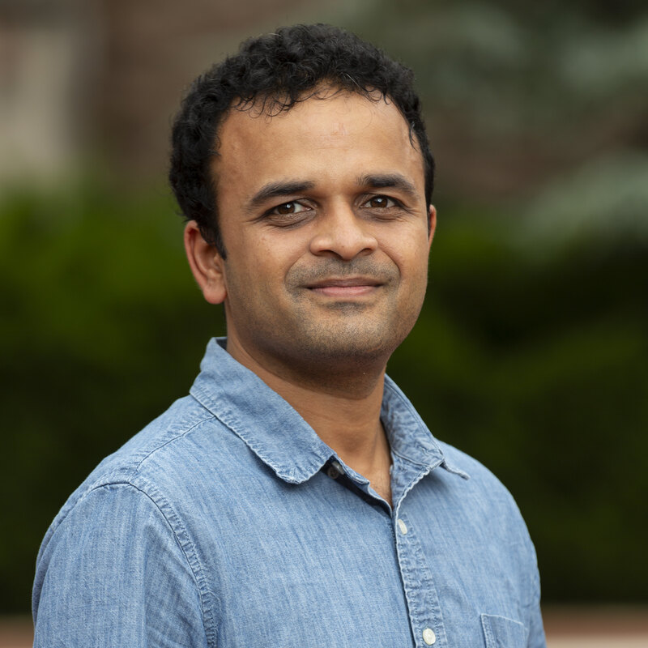

# Aditya Upadhyayula

<figure markdown="span">
  { width="260" .portrait }
</figure>

## About me

I am a postdoc at Washington University in St. Louis. I work with
[Jeffrey Zacks](https://psych.wustl.edu/people/jeffrey-zacks) and
[Zachariah Reagh](https://psych.wustl.edu/people/zachariah-reagh) on how we represent and
remember continuous experiences, using naturalistic movies, eye tracking, computational
modeling and fMRI.

Before that I worked with [John Henderson](https://viscoglab.ucdavis.edu/) at UC Davis,
where I studied how we
perceive naturalistic movies and the predictive role the visual system plays in that
process. That is where I became interested in how events are represented, which led to my
current line of work. I received my PhD from Johns Hopkins University, where I trained with
[Jonathan Flombaum](https://pbs.jhu.edu/directory/jonathan-flombaum/) in vision science.

I grew up in India, where I did my schooling and undergraduate studies. Before cognitive science, my background was in physics
and electrical & computer engineering. And I really enjoy walking, big trees, and some Carnatic and jazz music.

[:octicons-arrow-right-24: What I work on](research/index.md)

## Get in touch

I am always glad to hear from people — about the research, possible collaborations, or if
you have questions about anything here.

:material-email: [shanmukha@wustl.edu](mailto:shanmukha@wustl.edu)

:material-butterfly: [@adibuoy23.bsky.social](https://bsky.app/profile/adibuoy23.bsky.social)

:material-map-marker: Somers Family Hall 402, Washington University, Campus Box 1125,
One Brookings Dr, St. Louis, MO 63130-4899
