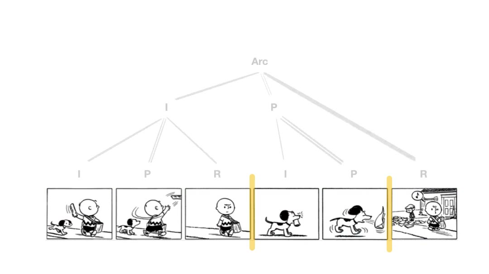
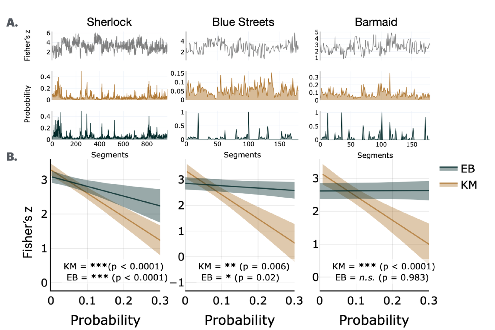

# How is information organized?

Key moments are not scattered at random through an experience; they land where a story turns.
That suggests the structures we usually associate with language — hierarchy, syntax, thematic
arc — are organizing far more than sentences. Here I borrow tools from psycholinguistics and
NLP to ask what that structure is, and what makes a moment matter within it.

  <a class="proj-card" href="visual-narrative-grammar/">
    
    
      Does visual narrative comprehension involve a grammar?
      From cave paintings to murals, visual storytelling has long existed as a communicative tool. When comprehending visual narratives, do we parse them using a grammar, similar to that of language?
      Read more →
    
  </a>
  <a class="proj-card" href="what-makes-a-moment-key/">
    
    
      What makes a moment key?
      Semantic information. Key moments scaffold the semantic structure in narratives. Cut the key moments out of a narrative, the story's meaning collapses.
      Read more →
    
  </a>

