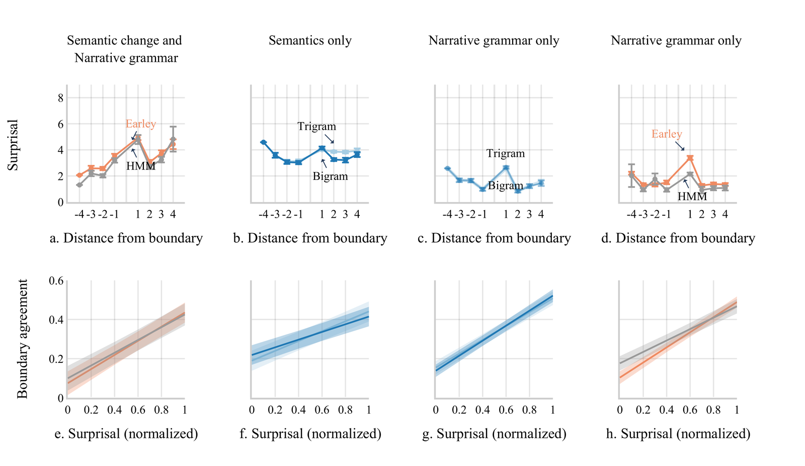

# Does visual narrative comprehension involve a grammar?

From cave paintings to murals, visual storytelling has long existed as a communicative tool.
When comprehending visual narratives, do we parse them using a grammar, similar to that of
language? Adapting tools from computational psycholinguistics, we demonstrate that a model with
grammatical properties can segment visual narratives similar to humans. Read more below:

<figure markdown="span">
  <video autoplay loop muted playsinline preload="auto"
         poster="../../../assets/images/fig-narrative-grammar-poster.jpg"
         width="1080" height="608"
         aria-label="An Earley parser building a hierarchical structure over a wordless comic strip">
    <source src="../../../assets/images/fig-narrative-grammar.webm" type="video/webm">
    <source src="../../../assets/images/fig-narrative-grammar.mp4" type="video/mp4">
    <a href="../../../assets/images/fig-narrative-grammar.mp4">An Earley parser building a
    hierarchical structure over a wordless comic strip</a>
  </video>
</figure>

<figure markdown="span">
  
  <figcaption>Model comparison. Panel titles give the information each model had access to — <em>semantics</em> (changes in space, location, causality) and <em>narrative grammar</em> (the E, I, P, R categories and their pairing rules). <strong>Top:</strong> surprisal by distance from the boundary; only models with grammatical structure spike at the boundary itself. <strong>Bottom:</strong> human boundary agreement rises with each model's normalized surprisal. Error bars show standard error, shaded regions 95% CI.</figcaption>
</figure>

*Upadhyayula & Cohn (2025), Cognitive Science.*
[:material-file-document: Paper](https://doi.org/10.1111/cogs.70050) ·
[:material-database: Data & code](https://osf.io/s2h5x/) ·
[:material-youtube: Talk](https://www.youtube.com/watch?v=eEBSmQwxVmk)

---

[:octicons-arrow-left-24: Back to How is information organized?](index.md)
