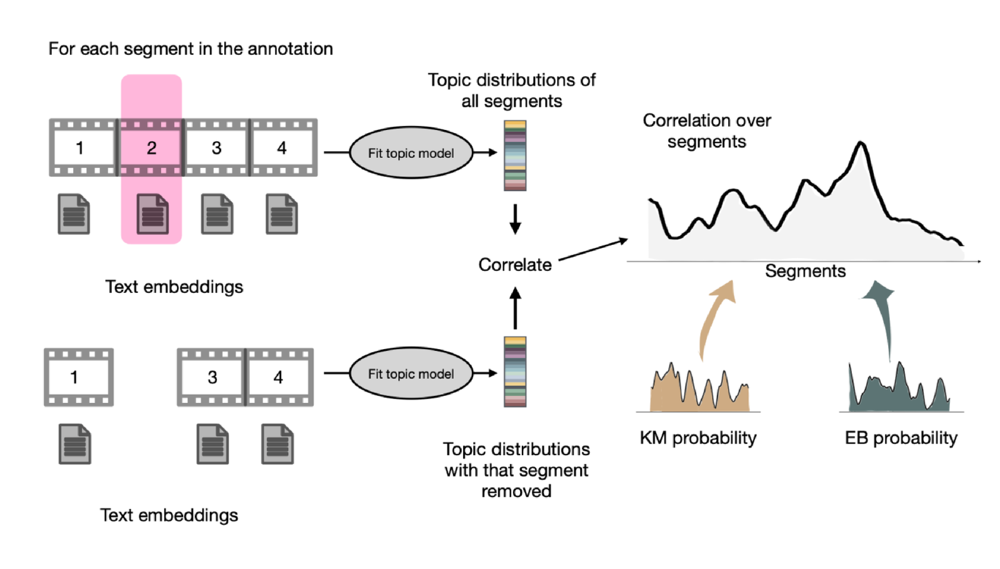

# What makes a moment *key*?

**TL;DR:** Semantic information. Key moments scaffold the semantic structure in narratives.
Cut the key moments out of a narrative, the story's meaning collapses. We studied this using
topic modeling on participant recalls and movie transcripts across three different movies.
Read more...

<figure markdown="span">
  
  <figcaption>The ablation pipeline. Topic models are trained on participants' recalls and applied to the film annotation. Each segment is removed in turn, the ablated and intact topic distributions are correlated, and the resulting curve is compared against key moment and event boundary probabilities.</figcaption>
</figure>

<figure markdown="span">
  
  <figcaption><strong>A.</strong> Semantic disruption over time, with key moment (orange) and event boundary (teal) probabilities, across three films. <strong>B.</strong> Disruption falls off more steeply with key moment probability than with event boundary probability — significantly so in all three films, where event boundaries are weaker or absent.</figcaption>
</figure>

*Kim, Upadhyayula et al. (under revision).*
[:material-file-document: Preprint](https://osf.io/preprints/psyarxiv/dcfvw_v1) ·
[:material-database: Data & code](https://osf.io/8r57t/) ·
[:material-chart-box-outline: Key Moments visualization tool (access on request)](https://adibuoy23.github.io/storyboard-visualization/)

---

[:octicons-arrow-left-24: Back to How is information organized?](index.md)
