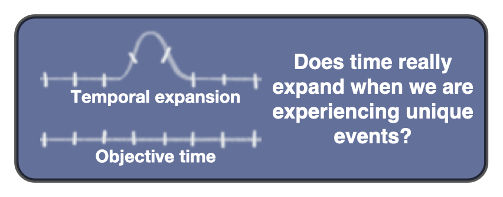
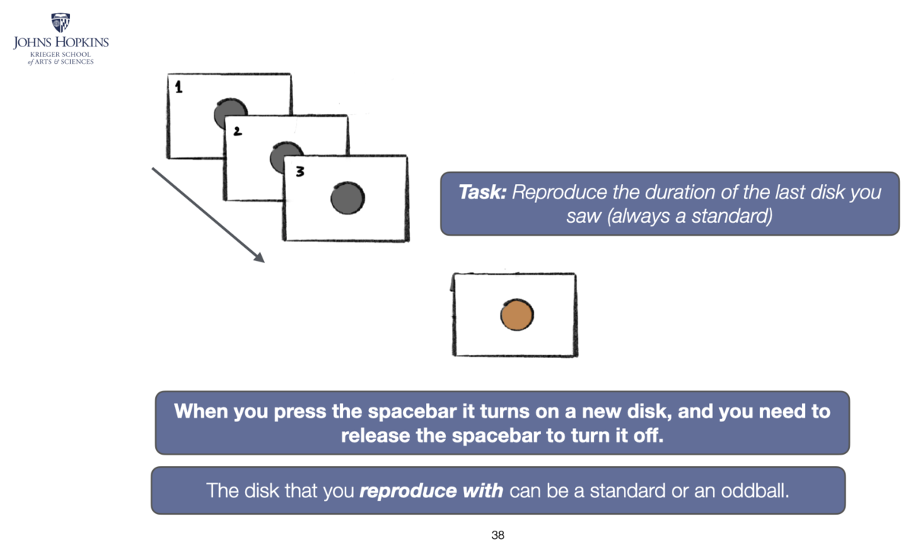
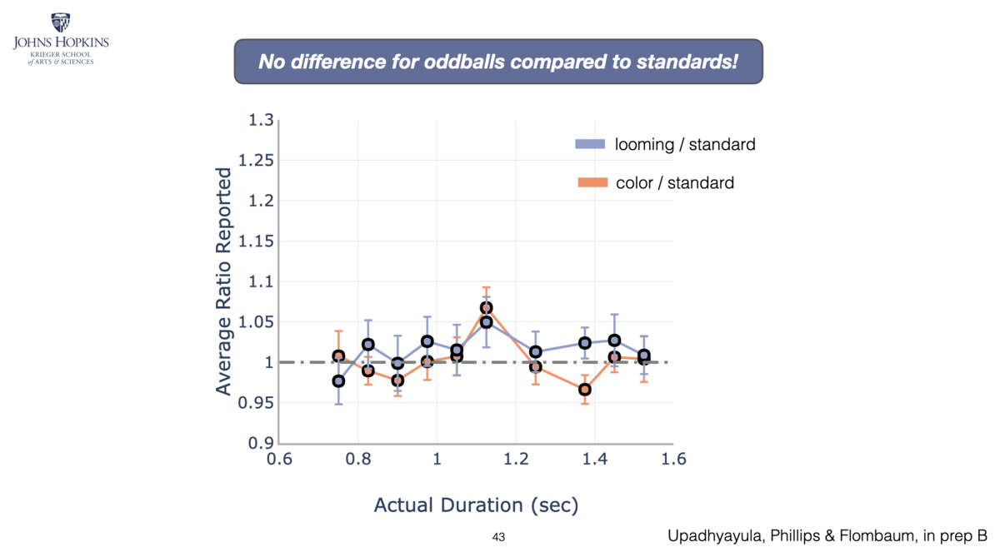

# How do we experience the passage of time?

Time is said to expand during novel or frightening events — *tachypsychia*. We asked whether
it really does. It does not: perception of duration stays put, and it is **memory for the
event that is distorted**. What feels like time stretching is a trick played after the fact.

  <figure>
    
    <figcaption>The question: does time really expand during unique events, or only seem to?</figcaption>
  </figure>
  <figure>
    
    <figcaption>The task: reproduce the duration of the last disk by holding the spacebar. The disk you reproduce with can be a standard or an oddball.</figcaption>
  </figure>
  <figure>
    
    <figcaption>The result: no difference for oddballs compared with standards — reproduced durations sit on the line of veridical performance.</figcaption>
  </figure>

*Upadhyayula, Phillips & Flombaum (in preparation).* Presented at Vision Sciences Society 2020.
[:material-youtube: Poster talk](https://www.youtube.com/watch?v=w82668xFLfg) ·
[:material-play-circle: Try the experiments](../../resources/index.md)

---

[:octicons-arrow-left-24: Back to How is information perceived?](index.md)
