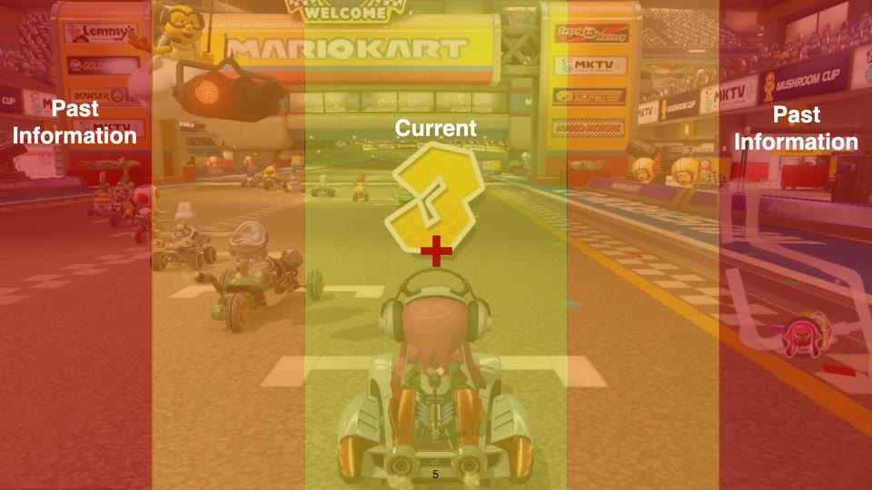
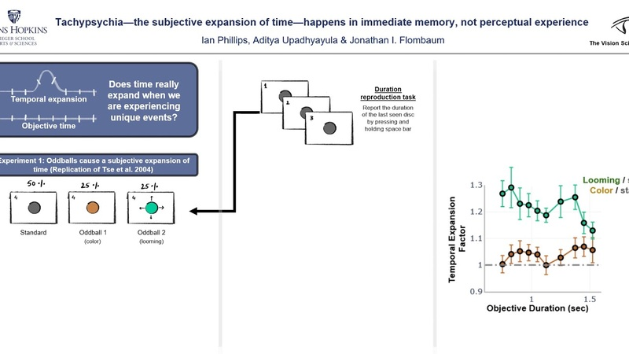
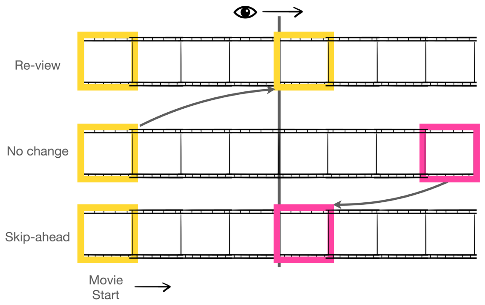
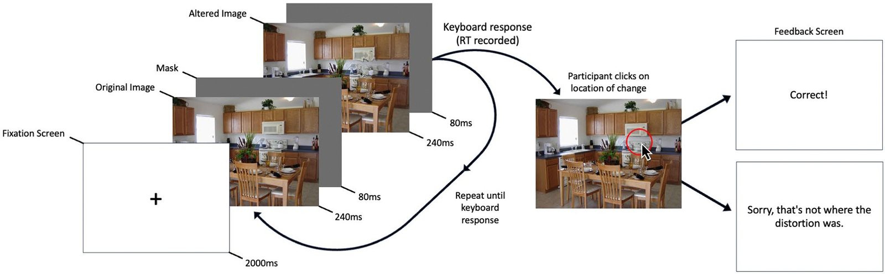
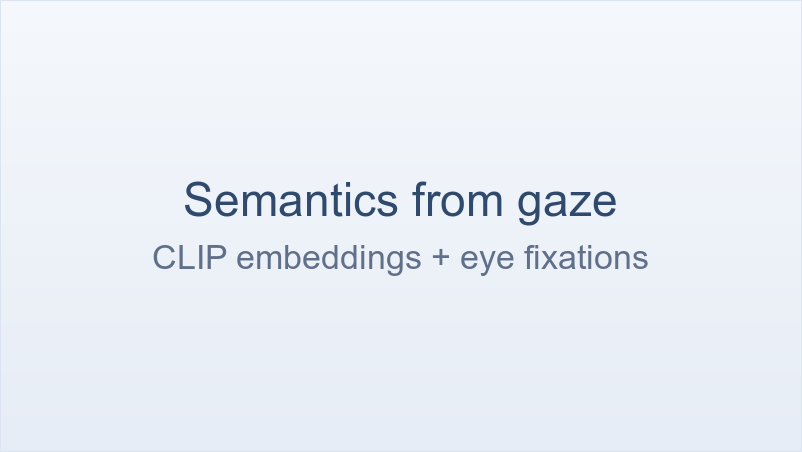

# How is information perceived?

Photoreceptor density falls off sharply from the fovea to the periphery, so we must
**constantly move our eyes** to bring what matters into central focus. That constraint shapes
both recognition and memory: objects never directly fixated may be poorly encoded, or missed
altogether. Most work on this uses controlled tasks with a single endpoint — find the target,
or report its absence — where gaze can be strategically optimized. Far less is known about
what a foveate system means for perception and memory in **dynamic, unfolding environments**.
My early work used controlled displays to open that gap; the later work moves to naturalistic
film and real scenes, where the input is continuous, semantically rich, and never waits for
you.

  <a class="proj-card" href="why-can-we-only-track-a-few-things-at-once/">
    
    
      Why can we only track a few things at once?
      Watch a shell game and you lose the ball. The usual explanation appeals to "mental effort," which is hard to pin down. My explanation is simpler: where you look. I built a model that takes a participant's own eye movements as input and tracks the targets…
      Read more →
    
  </a>
  <a class="proj-card" href="how-do-we-experience-the-perception-of-now/">
    
    
      How do we experience the perception of now?
      Not all at once. By breaking the synchrony between foveal and peripheral vision in an RSVP task, we found that the moment you experience as the present is stitched together from present information at the center of gaze and past information from the…
      Read more →
    
  </a>
  <a class="proj-card" href="how-do-we-experience-the-passage-of-time/">
    
    
      How do we experience the passage of time?
      Time is said to expand during novel or frightening events — tachypsychia. We asked whether it really does. It does not: perception of duration stays put, and it is memory for the event that is distorted. What feels like time stretching is a trick played…
      Read more →
    
  </a>

## From laboratory to naturalistic experiences

Controlled displays establish what the visual system is given. The work below asks what it does with that in the wild — in films and real scenes, where the input is continuous, semantically rich, and never waits for you.

  <a class="proj-card" href="predictive-constraints-on-vision/">
    
    
      Predictive constraints on vision
      Despite gaps in sensory input and attention, conscious experience feels rich and continuous. One possibility is that the mind intelligently bridges those gaps. To test that, I embedded films with brief temporal disruptions — jumps forward or backward in…
      Read more →
    
  </a>
  <a class="proj-card" href="what-drives-change-blindness-in-naturalistic-scenes/">
    
    
      What drives change blindness in naturalistic scenes?
      Whatever is less meaningful. Using meaning maps — aggregated ratings of how meaningful each patch of an image is — we found that changes in high-meaning regions are caught faster in a change blindness task. Semantic knowledge about the world does real…
      Read more →
    
  </a>
  <a class="proj-card" href="can-eye-movements-tell-us-what-a-scene-means/">
    
    
      Can eye movements tell us what a scene means?
      Where people look is a readout of what they find meaningful — so gaze should be predictable from semantics alone. Ongoing work with Sophie Su uses CLIP embeddings together with eye fixation maps to characterize the semantic content of a film as it unfolds,…
      Read more →
    
  </a>

