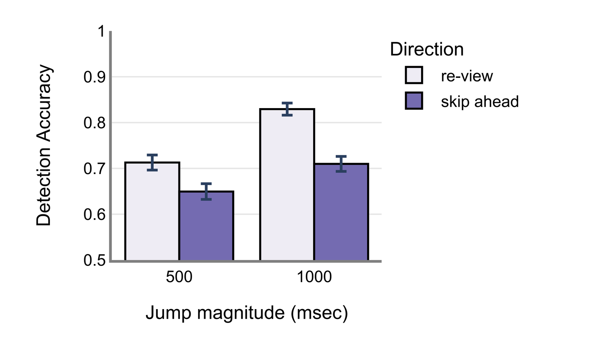

# Predictive constraints on vision

Despite gaps in sensory input and attention, conscious experience feels rich and continuous.
One possibility is that the mind intelligently bridges those gaps. To test that, I embedded
films with brief temporal disruptions — jumps forward or backward in time, triggered during
saccades, when processing is already interrupted. Participants are required to report these
"glitches" by pressing a button.

<figure markdown="span">
  
  <figcaption>During an occasional saccade the clip jumps backward (re-view), forward (skip-ahead), or continues unchanged.</figcaption>
</figure>

Detection stayed well below ceiling: even substantial temporal violations often go unnoticed.
And participants were **less sensitive to forward than to backward jumps** — disruptions that
run with the anticipated trajectory of an unfolding experience are missed more often than
those that violate it. Replicating the paradigm with flicker-contingent changes, yoked to
brief blank screens rather than to eye movements, left the asymmetry intact. The effect
reflects broad principles of temporal prediction, not low-level oculomotor suppression.

*Upadhyayula & Henderson (2023), Journal of Vision · (2024), Attention, Perception &
Psychophysics.*
[:material-file-document: JoV](../../files/papers/Spatiotemporal_saccade_paper.pdf) ·
[:material-file-document: AP&P](https://rdcu.be/du6GP) ·
[:material-database: JoV data](https://osf.io/j95z3/) ·
[:material-database: AP&P data](https://osf.io/296jh/) ·
[:material-play-circle: Try the demo](../../resources/index.md)

---

[:octicons-arrow-left-24: Back to How is information perceived?](index.md)
