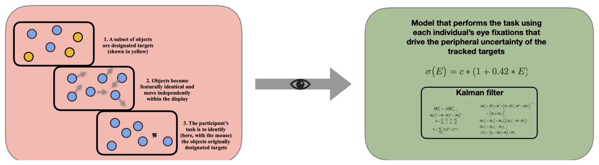
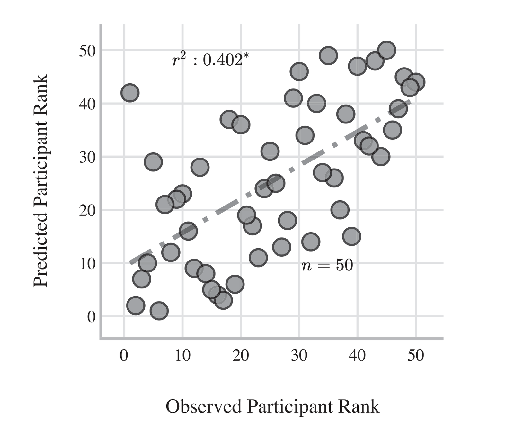

# Why can we only track a few things at once?

Watch a shell game and you lose the ball. The usual explanation appeals to "mental effort,"
which is hard to pin down. My explanation is simpler: where you *look*. I built a model that
takes a participant's own eye movements as input and tracks the targets the way they did —
and it predicts who will be good at the task and who won't.

<figure markdown="span">
  
  <figcaption>The task and the model. Peripheral uncertainty about each target grows with its eccentricity from the current fixation, and a Kalman filter tracks the targets under that uncertainty — so a participant's own fixations drive the model's performance.</figcaption>
</figure>

<iframe src="https://giphy.com/embed/NusOH30J7QiJy" width="480" height="286" frameborder="0" class="giphy-embed" allowfullscreen title="Shell game"></iframe>

*Upadhyayula & Flombaum (2020), Cognition.*
[:material-file-document: PDF](../../files/papers/MOT_paper.pdf) ·
[:material-github: Code](https://github.com/Adibuoy23/Multiple-Object-Tracking)

---

[:octicons-arrow-left-24: Back to How is information perceived?](index.md)
