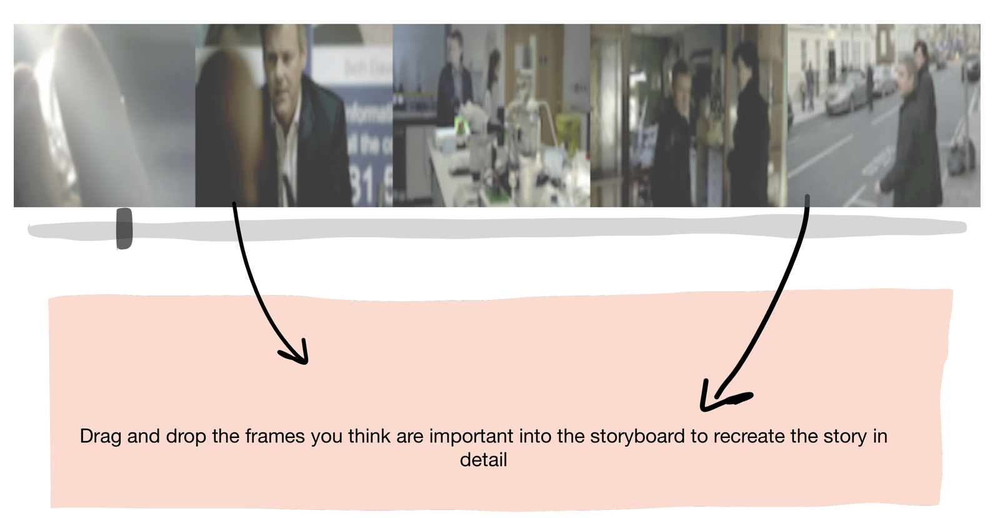
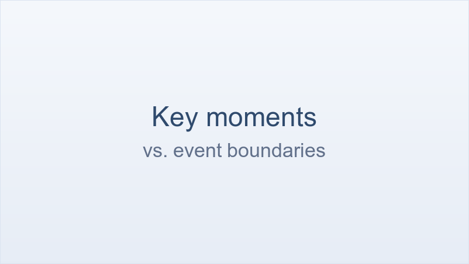
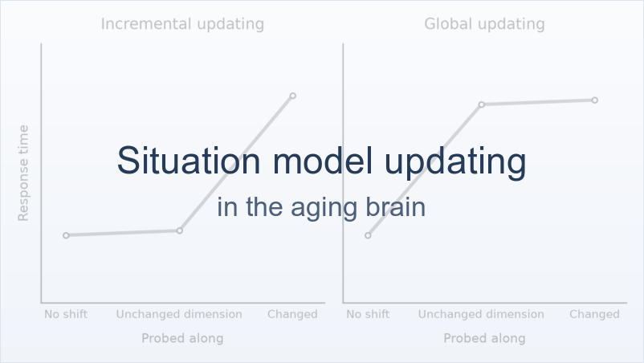

# How is information remembered?

If perception is already a reconstruction, memory is a far more brutal one: hours of
experience compressed into a few minutes you could recount. That compression cannot be
uniform — something has to decide which slivers are worth keeping. My current line of work
argues that continuous experiences are represented as a subset of **key moments**, which are
somewhat different from event boundaries, and that they play a crucial role in memory and
comprehension. Explore more below:

  <a class="proj-card" href="how-are-experiences-represented-and-remembered/">
    
    
      How are continuous experiences represented and remembered in the brain?
      Not all moments are equal. I ask people to watch a film and pick the frames that best tell its story — a storyboard. People agree strikingly well on which frames matter. Those same moments are when viewers' brains fall into sync with each other in the…
      Read more →
    
  </a>
  <a class="proj-card" href="are-key-moments-just-event-boundaries/">
    
    
      Are key moments just event boundaries?
      Partly, but not entirely — and the usual comparison cannot tell, because construct and measurement method are confounded. We crossed key moments against event boundaries, and real-time button presses against retrospective frame selection.
      Read more →
    
  </a>
  <a class="proj-card" href="updating-information-and-aging/">
    
    
      How do we update information when comprehending narratives, and how does that change as we age?
      Reading a story means keeping a running model of it in your head. When the story shifts, do you swap out just the part that changed, or rebuild the whole thing? Younger and older adults answer differently.
      Read more →
    
  </a>

